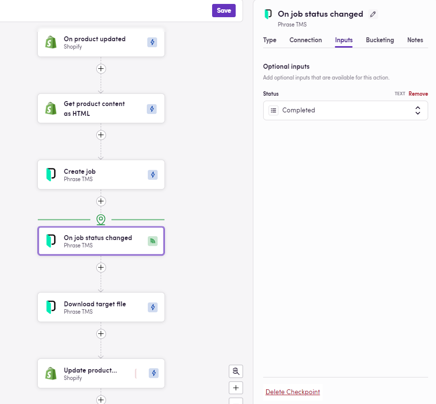
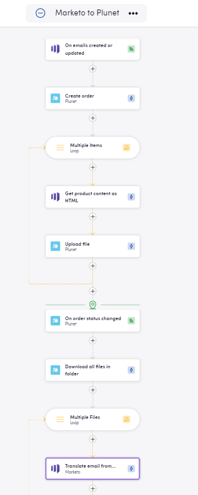
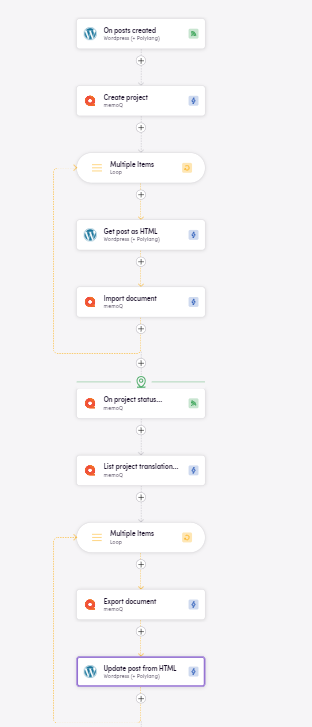
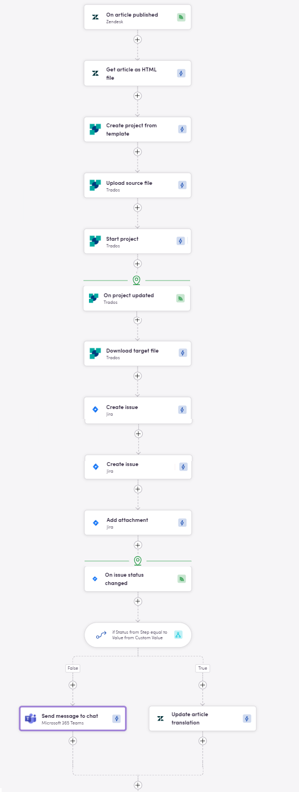
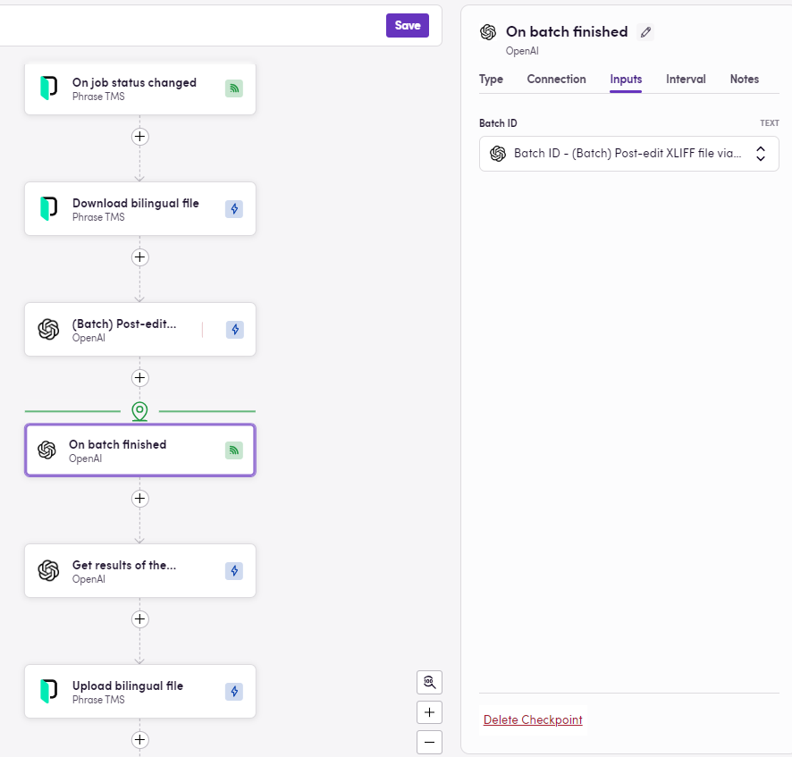

Blackbird has released a powerful new feature called Checkpoints, designed to enhance workflow automation with the ability to manage multiple triggers and enable human intervention at key points. This guide explains how Checkpoints work, their benefits, and how you can leverage them for greater efficiency and control in your workflows.

## What are Checkpoints?

Checkpoints in Blackbird workflows are _control steps_ that enable Birds to **pause and wait** for different events before continuing their Flights. These triggers could be a mix of automated and human-driven actions. Instead of following a single, linear trigger path, Checkpoints allow for flexible handling of workflows where pauses for approvals, reviews, or external events are necessary.

Traditional workflows typically follow a single chain of events, triggered by one initial action (e.g., a file being uploaded or a task being assigned). With Checkpoints, multiple trigger points are embedded within a Bird, allowing for pauses and checks along the way. This creates more adaptable processes, especially useful when certain steps require human involvement or need to wait for external systems to respond or long running tasks to be completed. E.g. after sending a document for translation we have to wait for the translation to be done before we can publish it. **This feature turns complex multi-Bird workflows into one comprehensive Bird**.

## What Advantages Do Checkpoints Offer?

**Key benefits**:

1. **Workflows are better aligned with mental processes**. One Bird comprises an entire workflow.
2. **Increased Bird efficiency**. One Bird can replace a process that needed to be split into several Birds.
3. **No need for Entity linking or custom fields** to map the same entities accross Birds. Since the complete process is described in one Bird, information is passed on seamlessly from previous steps.

## How do I add a Checkpoint to my Bird?

Click on the plus sign as you would to add any other step and select `Checkpoint`. Choose between waiting for an `Event` in an app to happen or a specific amount of time (`Delay`). If you've chosen to wait for an event, you need to click continue or go to the `Connection` tab, then select the app, the type of event, your connection and the ID for the exact object to monitor — if you are awaiting a project to be completed, you can specify the project ID so your Flight only continues once this specific project is completed. If the Delay option was selected instead, you need to specify the amount of time to wait in the `Duration` tab.

## Examples

### Translation Management Systems (TMS)
For businesses utilizing TMS tools (like Phrase or RWS WorldServer, etc.), translation tasks usually need to be performed by a human. Checkpoints allow workflows to halt until translations are reviewed or completed.

The image above shows a Bird that takes new posts from Wordpress, creates a project in MemoQ, imports the posts as HTML source documents into the newly created MemoQ project, waits for the project status in MemoQ to be "Wrapped up", then downloads the translated documents and uploads them into Wordpress.

### Human Approvals in Project Management
In platforms like Asana, Jira, or Trello, certain tasks require approval before proceeding. With Checkpoints, workflows can pause until the necessary review or approval is completed. This ensures nothing is missed, and approvals are smoothly integrated into the process.

The picture above shows a Bird with two Checkpoints. The flow starts whenever a new Zendesk article is published, the content from the new article is extracted as HTML and added as source file in a newly created Trados project. At this point, the process is paused and once the project is updated and reahed the desired status, the target file is downloaded and added as attachment to a new Jira issue. A new halt is reached as the flow awaits for the status of the Jira issue to be changed, allowing for human intervention — maybe a legal or marketing team needs to review the translation. A decision point is reached afterwards: if the new status is "Approved", then the translated Zendesk article is published. Otherwise, the corresponding Teams channel is notified. 

### Large Language Models (LLMs) & Batch Processing
When using LLM services like OpenAI’s Batch API for content generation or data processing (especially long running tasks), a Checkpoint can pause the workflow until the LLM returns a result or a batch process completes. If further human validation is required, the workflow can wait for that input before moving to the next stage.

The image above depicts a Bird where bilingual files are exported from Phrase as soon as jobs reach a specific status, then said files are process via OpenAI Batch API. The workflow comes to a halt until the Batch processing is completed and once this happens, the resulting files are uploaded back to Phrase. 
