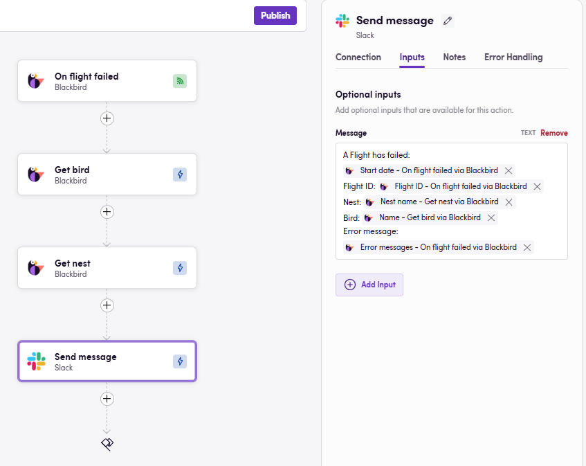
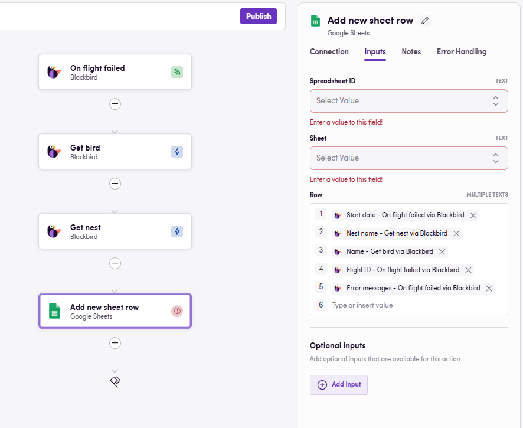
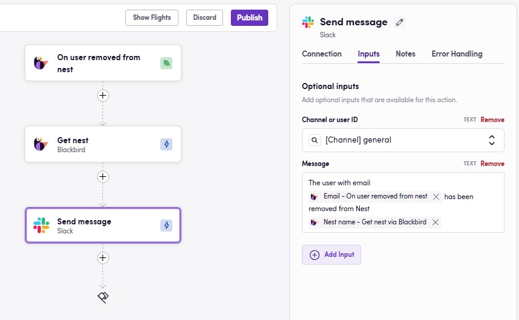
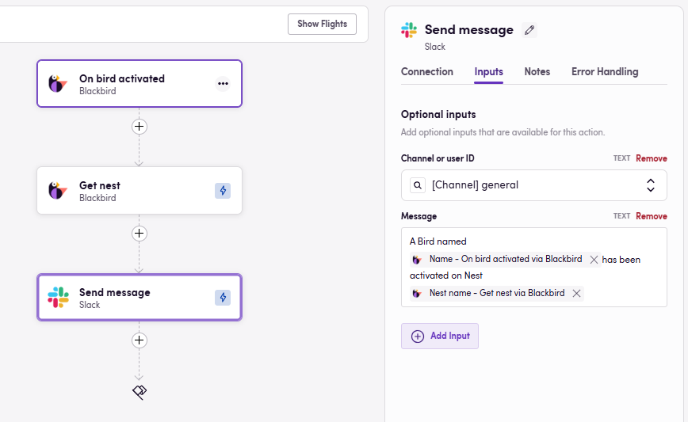

### Eggs: Starting Points for Your Birds

In Blackbird, Eggs are the seeds or blueprints for your workflows. They represent the initial ideas that have the potential to become fully-fledged Birds.

In this Egg-guide, let's explore some options to monitor and get notified whenever something happens in your Blackbird instance in a centralized fashion. Find **Downloadable Eggs** after each use case.

## Stay in the Loop with the Blackbird App

With so many Nests, Birds, users and Flights in action, it’s easy to lose track of the flock. Blackbird was designed to soar quietly in the background, automating your workflows without requiring constant check-ins. But what happens when a Bird is suspended, a user joins or leaves a Nest, or a Flight takes a nosedive? That’s where the Blackbird app comes in! Think of it as your trusty watchtower, keeping an eye on all the activity in your Blackbird instance. Whether it’s logging updates in a spreadsheet or chirping notifications straight to Slack, Teams, or Outlook, the Blackbird app ensures you’ll never miss a beat—or a tweet.

## Use cases

### Error notification or tracking

The most popular use case for the Blackbird app in Blackbird is monitoring failed Flights. You can receive real-time notifications containing key details such as the error message, Nest name, Bird name, Flight ID, and start date. Alternatively, you can log these failed Flights in a spreadsheet for later review or to populate dashboards.

> Use optional inputs to monitor a specific Nest, otherwise a single Bird will monitor all Nests within your Blackbird instance.

Error escalation Bird

- Download Egg: <a href="https://docs.blackbird.io/downloads/Report_failed_Flights_on_Slack.json" download>Report failed Flights on Slack</a>
- Download Egg: <a href="https://docs.blackbird.io/downloads/Report_failed_Flights_on_Teams.json" download>Report failed Flights on Teams</a>
- Download Egg: <a href="https://docs.blackbird.io/downloads/Report_failed_Flights_via_Outlook_email.json" download>Report failed Flights via Outlook email</a>
- Download Egg: <a href="https://docs.blackbird.io/downloads/Report_failed_Flights_via_Gmail.json" download>Report failed Flights via Gmail</a>

Error logging Bird

- Download Egg: <a href="https://docs.blackbird.io/downloads/Log_failed_Flights_on_Google_Sheets.json" download>Log failed Flights on Google Sheets</a>
- Download Egg: <a href="https://docs.blackbird.io/downloads/Log_failed_Flights_on_Microsoft_Excel.json" download>Log failed Flights on Microsoft Excel</a>

### Users added or removed

Monitor users added or removed from an specific Nest.

- Download Egg: <a href="https://docs.blackbird.io/downloads/On_user_removed_send_Slack_message.json" download>On user removed send Slack message</a>

### Birds suspended or activated

Get notified when Birds are suspended or activated: get real time notifications of changes in your Production Nest.

> Use optional inputs to monitor a specific Nest, otherwise a single Bird will monitor all Nests within your Blackbird instance.

- Download Egg: <a href="https://docs.blackbird.io/downloads/On_Bird_activated_send_Slack_message.json" download>On Bird activated send Slack message</a>

## Importing Eggs

To import an Egg into your Nest:

1. Navigate to the Bird Editor section.
2. Click on Import on the top right.
3. Select the Egg (JSON) file to import and click `Import`.
4. Identify the newly created Bird and click on it to edit it.
5. Add Connection details and any other needed input parameters or desired steps. Look for red warning signs next to the step name signaling missing details in said step.
6. Click on the three dots next to the Bird's name and update the apps if there are updates available.
7. Click Save/Publish.

