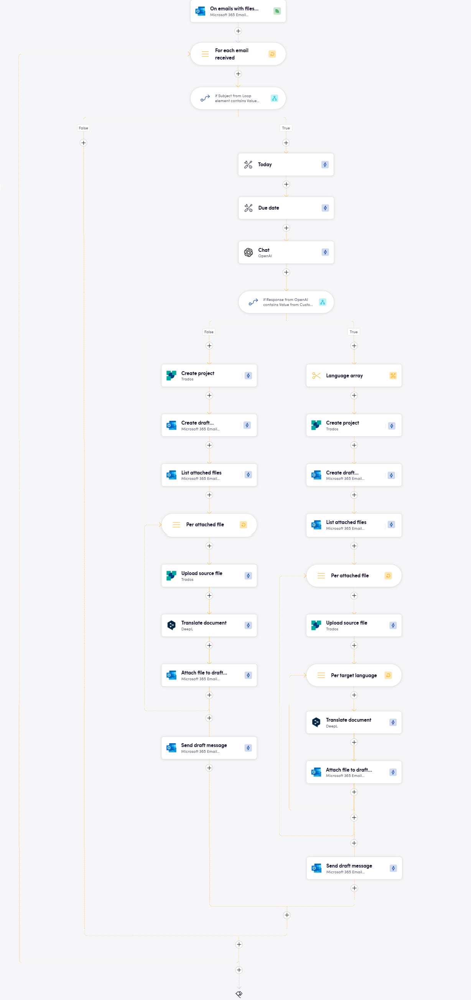
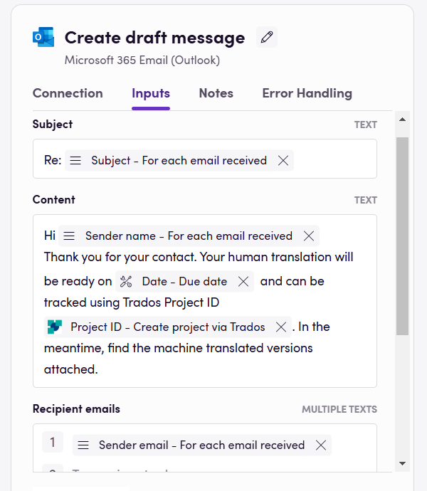
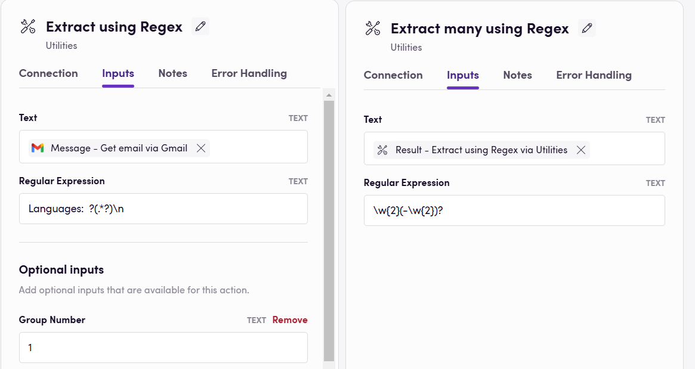

### Eggs: Starting Points for Your Birds

In Blackbird, Eggs are the seeds or blueprints for your workflows. They represent the initial ideas that have the potential to become fully-fledged Birds.

In this Egg-guide, let's explore some common use cases around emails using [Microsoft Outlook](https://docs.blackbird.io/apps/microsoft-365-email-outlook/) or [Gmail](https://docs.blackbird.io/apps/gmail/). Find **Downloadable Eggs** at the end - download JSON workflows to [import into your Nest](https://docs.blackbird.io/eggs/emails/#importing-eggs), add your connections, make any desired adjustments, and **fly**.

## Process Outline

1. **Trigger: Email with attachments received**
As soon as an email with files attached is received, the Bird starts. 
2. **Information extraction**
Either by using regular expressions or an LLM, relevant data is collected. Attached files are downloaded
3. **Order/project creation**
The extracted information from the email body is used to fill in a new order or project. Files are uploaded.
4. **Email reply**
New order/project details are sent as reply. Machine translated files can also be sent as immediate response.

## Tips

- **Filters:** Decision steps or filters can be added to ensure that only the correct emails are picked up. E.g. checking if the subject contains certain pre-defined keywords. If you are using the [Gmail](https://docs.blackbird.io/apps/gmail/) app, a filter can be added to the `On emails received` trigger in the form of a search query.  
- **Information extraction:** a form structure can be agreed to extract information using regular expressions.This can be error prone due to depending of human inputs. An LLM can also be used to get the important details from the email body in the required format. 
- **Language conversion:** Apps use different language code standards. [Libraries](https://docs.blackbird.io/concepts/libraries/) will help solve these differences.
- **Machine translation:** MT apps can be used to return translated files almost immediately.
- **Quality estimation** A decision step can be added to determine whether the MT translations should be sent back as final or routed towards human review.
- **Polling Events:** Some apps use [polling](https://docs.blackbird.io/concepts/triggers/#polling) instead of webhooks to detect new emails. Check for an _Interval_ tab when setting up your trigger and choose the appropriate time for you (between 5 minutes and 7 days).

Egg getting emails from Outlook into DeepL and Trados.

Closer look at reply email.

Example prompt to get language codes

Extracting language codes using Regular expressions.

## Download an Egg

Download JSON workflows to import into your Nest, make any desired adjustments, and **fly**.

- <a href="https://docs.blackbird.io/downloads/Outlook_MT_memoQ.json" download>Outlook emails to DeepL to memoQ</a>
- <a href="https://docs.blackbird.io//downloads/Outlook_MT_Trados.json" download>Outlook emails to DeepL to Trados</a>
- <a href="https://docs.blackbird.io//downloads/Gmail_to_quote.json" download>Gmail to quote</a>

## Importing Eggs

To import an Egg into your Nest:

1. Navigate to the Bird Editor section.
2. Click on Import on the top right.
3. Select the Egg (JSON) file to import and click `Import`.
4. Identify the newly created Bird and click on it to edit it.
5. Update the Connection details and any other needed input/output parameters or desired steps. Look for red warning signs next to the step name signaling missing details in said step.
6. Click Save/Publish.

