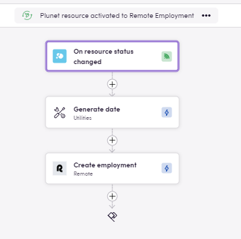
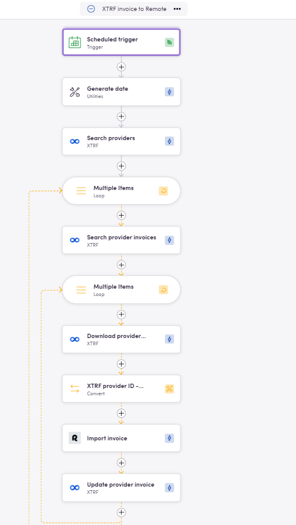
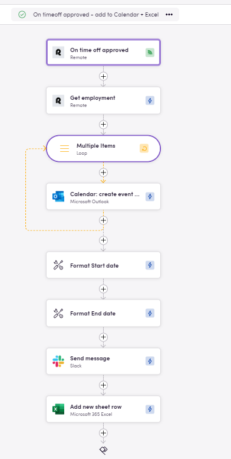

### Eggs: Starting Points for Your Birds

In Blackbird, Eggs are the seeds or blueprints for your workflows. They represent the initial ideas that have the potential to become fully-fledged Birds.

In this Egg-guide, let's explore some options to integrate [Remote.com](https://docs.blackbird.io/apps/remote/) with different apps. Find **Downloadable Eggs** under each use case - download JSON workflows to import into your Nest, make any desired adjustments, and **fly**.

## Use cases

### TBMS resource to Remote employment

The Bird shown below creates a new employment in Remote as soon as a new Resource has been set as Active in Plunet.

- <a href="https://docs.blackbird.io/downloads/Plunet_resource_activated_to_Remote_Employment.json" download>On Plunet resource activated create Remote employment</a>
- <a href="https://docs.blackbird.io/downloads/Remote_employment_completed_set_Plunet_resource_Active.json" download>On Remote employment completed set Plunet resource active</a>

### TBMS Invoices to Remote

This Bird is triggered weekly, searches invoices in XTRF that been updated during the last week, exports them and imports them into Remote. Note the Convert operator being used to pull data from a custom library. 

- <a href="https://docs.blackbird.io/downloads/XTRF_invoice_to_Remote.json" download>XTRF invoice to Remote</a>
- <a href="https://docs.blackbird.io/downloads/Remote_to_XTRF_invoice_status_update.json" download>Remote to XTRF invoice status update</a>

### On Remote triggers send notifications, log data, add calendar events

The image below displays a Bird that is triggered whenever a time off request has been approved in Remote, then adds an event to Microsoft 365 calendar, logs the time-off details in an Excel sheet and sends a Slack notification.

- <a href="https://docs.blackbird.io/downloads/On_timeoff_approved_add_to_Calendar_Excel.json" download>On timeoff approved add to calendar and Excel</a>
- <a href="https://docs.blackbird.io/downloads/Manual_payout_notification.json" download>Monthly manual payout notification</a>

## Tips

- **Mapping data across apps:** To map important data points that refer to the same (e. g. Contractor ID in Remote and Resource ID in Plunet), there are various options to use: 
    - (Custom libraries)[https://docs.blackbird.io/concepts/libraries/#custom-libraries] can be used to set up your data mapping and use them within your Birds via Convert operator in the same way you would use a VLookup formula in Excel. 
    - Custom fields. Many apps offer custom fields that can be defined as it best suits you. 
    - (Linked entities)[https://docs.blackbird.io/guides/entity-linking/]. 
- **Optional inputs:** Check the different input alternaives, especially on the event triggers since these give you options to filter when to trigger a Bird. As an example, if you use an "on status update" event trigger, you will most likely find the option to specify which status should start the process.

### Importing Eggs

To import an Egg into your Nest:

1. Navigate to the Bird Editor section.
2. Click on Import on the top right.
3. Select the Egg (JSON) file to import and click `Import`.
4. Identify the newly created Bird and click on it to edit it.
5. Update the Connection details and any other needed input/output parameters or desired steps. Look for red warning signs next to the step name signaling missing details in said step.
6. Click Save/Publish.

