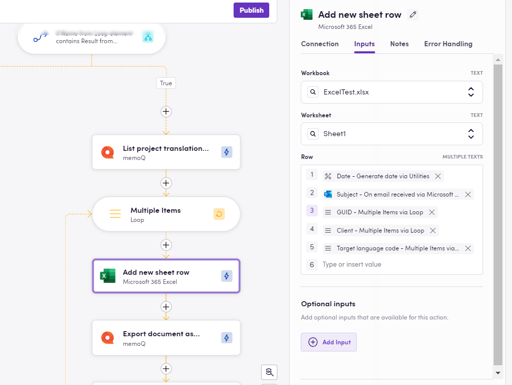
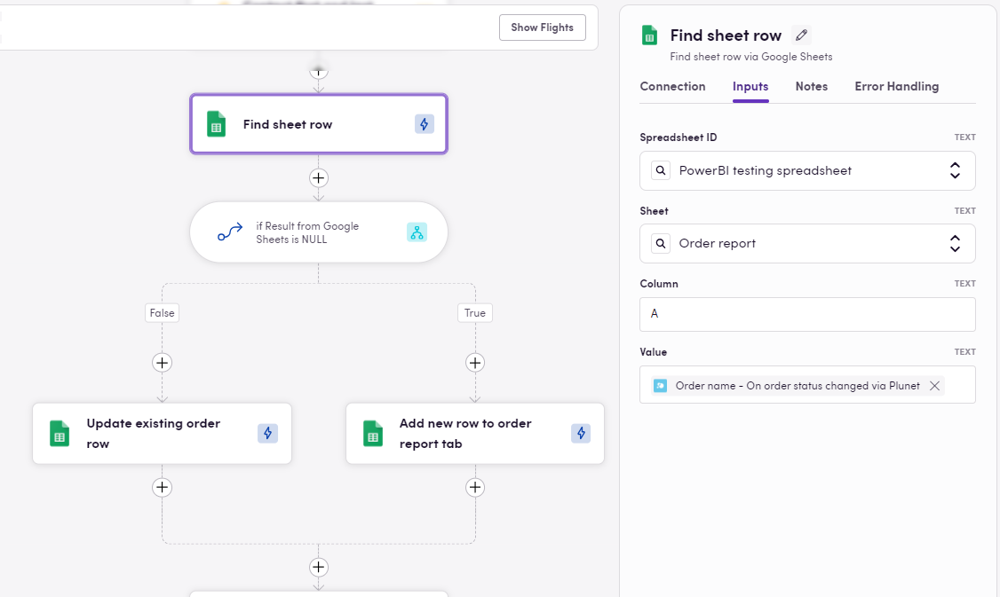
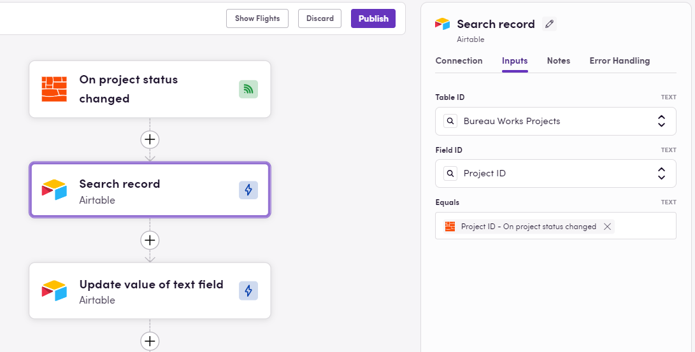
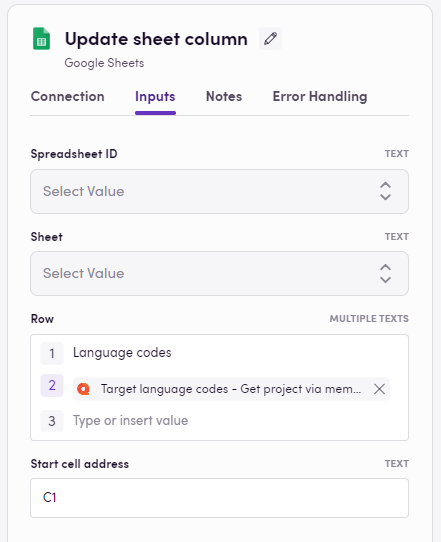
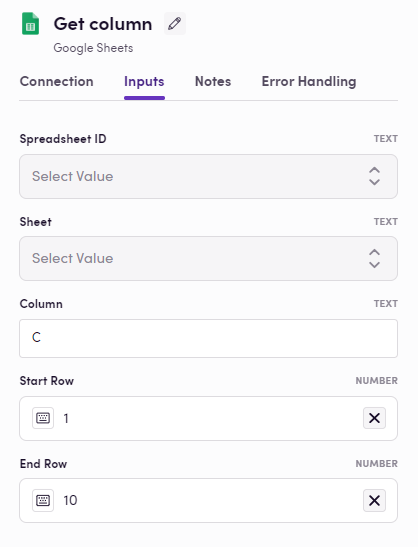

### Eggs: Starting Points for Your Birds

In Blackbird, Eggs are the seeds or blueprints for your workflows. They represent the initial ideas that have the potential to become fully-fledged Birds.

In this Egg-guide, let's explore some common use case around spreadsheets using [Google Sheets](https://docs.blackbird.io/apps/google-sheets/), [Microsoft Excel](https://docs.blackbird.io/apps/microsoft-excel/) or [Airtable](https://docs.blackbird.io/apps/airtable/). Find **Downloadable Eggs** under some use cases - download JSON workflows to [import into your Nest](https://docs.blackbird.io/eggs/remote/#importing-eggs), add your connections, make any desired adjustments, and **fly**.

## Use cases

### Logging and Reporting

Spreadsheets can be a powerful tool to capture key data points at various stages of a workflow. Not only to be used as internal logs, but also sending workflow information to an external spreadsheet offers enhanced visibility and potential integration with dashboard tools for real-time analytics.

The `Add new sheet row` action in Blackbird is ideal for this purpose. It **appends a new row at the end of the spreadsheet's used range** and allows multiple data points to be passed into consecutive cells, maintaining the order you specify in Blackbird. It will also check if there are rows available (Google Sheets) and add one in case we are at the spreadsheet's end. 

### Searching and Updating Information

Managing dynamic data in spreadsheets often involves searching for and updating specific information. The `Find sheet row` action **searches for a specified value within a designated column and returns the row number** where the value was found (or null if not found).
Example: You may have a column in your table with unique order IDs. Every time an update occurs, you want to log these changes (maybe a status update) in your spreadsheet, use the "Find sheet row" action to locate the relevant row for that particular order, and subsequent actions like "Update sheet row" or "Update cell" will allow you to modify information —such as the order status— in a different column but corresponding row.
This action can also be paired with a decision point to check if the unique value already exists in the spreadsheet. If the output is null, you can add a new entry; otherwise, update the existing one.

The same can be done in Airtable. The image below shows a Bird tha starts whenever a project status has been updated in Bureau Works, then the ID of the updated project is used as unique identifier in a column and we get the row information back by using the `Search record` action. Then, we update the correct cell with the new status for the corresponding project. Keeping my project information up to date. 

ADD EGG for airtable workflow

### Iterating Through Spreadsheet Rows

Many times workflows require to process data from a spreadsheet by iterating through its rows, either to extract data or to perform some processing and updates. In Blackbird, there are several ways you can loop through each row in a spreadsheet’s used range (or a subset), retrieve data from multiple columns, and add new data to these same rows.

#### Iterating Using a Generated Range:
If you already know the rows or subset of rows you want to work with, you can generate a range and iterate through it, using each number in the range as row number. 
1. Use the `Generate range` action in the Utilities app and input start and end numbers. E.g. inputing 2 as start and 5 as end will return [2,3,4,5].
2. Add a loop to iterate through the range, using the loop output as the current row number.
3. Inside the loop, use the `Get sheet cell` action to retrieve data by composing the cell address (combining the known column with the current row number from the loop).
4. After processing the extracted data, use the `Update sheet cell` action to add your result, or mark the row as processed.

In a very similar fashion, when the number of rows in the spreadsheet is unknown, you can dynamically get the used range to get the total number of rows in the spreadsheet.

1. Use the `Get used range` action to retrieve the total number of rows.
2. Generate a range based on the Row count output or use the Row IDs output directly as input for the loop.
3. As with the previous approach, loop through the rows, retrieve and process data with `Get sheet cell`, and then update or mark each row via `Update sheet cell`.

> Note that you can input 2 as the start row for your range generation in case you want to spare the spreadsheet headers.

#### Iterating Through Rows Using Arrays:
If you need to extract multiple values from each row, treating each row as an array of cell values can simplify the process. This approach is also more efficient as it entails making fewer API calls. 

1. Use either `Get used range` or `Get range` to retrieve a set (or subset) of rows as arrays of cell values.
2. Add a loop with the actual Rows output as input.
3. Use the `Get entry by position` action from the Utilities app to extract specific column values based on their position in the array (e.g., position 3 for column C).
4. After you have processed the data, you can `Update sheet cell` by composing the cell address (using Row ID from the loop and specifying the column)

ADD EGGS HERE

### Getting or Updating Column Values in Bulk
In some workflows, it might be necessary to handle bulk updates or retrieve multiple values from a single column in a spreadsheet. There are some specific actions available that will save time by processing entire columns at once, instead of doing it row by row.

#### Update Sheet Column
When you have a list or array of values (e.g., target language codes or file names) that you want to populate in a spreadsheet column, the `Update sheet column` action makes it easy. This action can take as input one or more arrays and/or a group of single values. These will be written into the spreadsheet's specified column one value below the other starting in the provided cell address and respecting the same order as they were listed in the action's input.

#### Get Sheet Column

Similarly, you might need to retrieve a set of values from a specific column for later use. Use the `Get column` action to specify the column (e.g., column C) and the start and end cells (e.g., 1 to 10). The output will be an array containing the values from the specified column range that you can later use as input for the subsequent steps.

### Importing Eggs

To import an Egg into your Nest:

1. Navigate to the Bird Editor section.
2. Click on Import on the top right.
3. Select the Egg (JSON) file to import and click `Import`.
4. Identify the newly created Bird and click on it to edit it.
5. Update the Connection details and any other needed input/output parameters or desired steps. Look for red warning signs next to the step name signaling missing details in said step.
6. Click Save/Publish.

