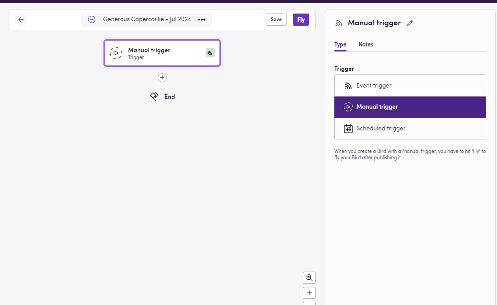
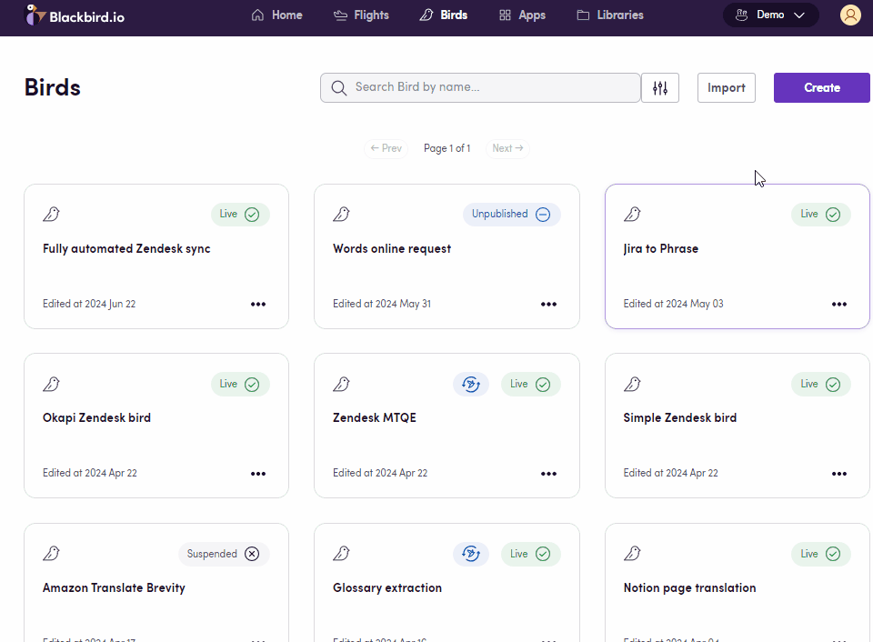

### Eggs: Starting Points for Your Birds

In Blackbird, Eggs are the seeds or blueprints for your workflows. They represent the initial ideas that have the potential to become fully-fledged Birds.

In this Egg-guide, let's explore some options to integrate cloud storage with machine translation. [Find **Downloadable Eggs** at the end!](https://docs.blackbird.io/eggs/storage-to-mt/#download-an-egg)

## Process Outline

1. **Trigger: File(s) uploaded to cloud storage**
Users upload files to a chosen cloud storage application. This action sets our workflow into motion.
2. **File download**
Files are downloaded from the cloud storage.
3. **Machine translation**
The downloaded files are sent to a machine translation engine for quick processing.
4. **Translated file upload**
Translated files are uploaded back to the cloud storage, placed in a designated output folder.

Egg between Google Drive and DeepL

## Tips

- **Polling Events:** Some apps use [polling](https://docs.blackbird.io/concepts/triggers/#polling) instead of webhooks to detect updated/new files. Check for an _Interval_ tab when setting up your trigger and choose the appropriate time for you (between 5 minutes and 7 days).
- **Glossary Integration:** Whenever the MT app allows it, users can add glossaries to enhance translation accuracy and consistency. Glossaries can be exported from a number of apps, and Blackbird will ensure compatibility (apps include TMS & CAT tools, [Microsoft Excel sheets](https://docs.blackbird.io/apps/microsoft-excel/#exporting-glossaries), [DeepL](https://docs.blackbird.io/apps/deepl/#glossaries), [OpenAI](https://docs.blackbird.io/apps/openai/#glossary-extraction)).
- **Target language:** You can select a language from the dynamic inputs of the MT app you are using. You can also use operators to cycle through a list of predefined languages (see Egg with multiple languages [at the bottom](https://docs.blackbird.io/eggs/storage-to-mt/#download-an-egg) and multiple language arrays right below the Tips section). Alternatively, you can also fetch this information from another app/action. It all depends on what your process looks like.
- **Optional parameters:** Many MT apps offer different parameters to be set, such as dictionaries, formality, and custom engine. Check the input tab for all steps.
- **Output folder setup:** When uploading your files back to the cloud storage of your choice, ensure to set up a new folder to prevent overwriting your original files or creating an infinite loop where translated files serve as a new trigger and are reprocessed.
- **Use the correct input:** When re-uploading your file, be certain to select the correct input. If you choose the exported file, then you will be re-importing the same exact file, without changes. Choose the output file from the translate action instead.
- **Loops are needed:** Whether to iterate through a list of target languages or to send each file within a group of downloaded files to an action that only takes one at a time, [loops](https://docs.blackbird.io/guides/loops/) are the key.
- **File renaming:** You can change the name of files before re-uploading them. If you want to append the target language code at the end of your file name or indicate through the file name that it has been MTed, you can use the [Utilities](https://docs.blackbird.io/apps/utilities/) app or other [helpers](https://docs.blackbird.io/guides/toolbox/). There is a downloadable workflow example for this at the [bottom of the page](https://docs.blackbird.io/eggs/storage-to-mt/#download-an-egg).

Egg between Google Drive and DeepL with glossaries.

Adding arrays of language codes.

## Suggested Apps

### Cloud Storage

- [Dropbox](https://docs.blackbird.io/apps/dropbox/)
- [Amazon S3](https://docs.blackbird.io/apps/amazon-s3/)
- [Box](https://docs.blackbird.io/apps/box/)
- [Google Drive](https://docs.blackbird.io/apps/google-drive/)
- [Microsoft SharePoint](https://docs.blackbird.io/apps/microsoft-sharepoint/)
- [SFTP](https://docs.blackbird.io/apps/sftp/)

### Machine Translation

- [Language Weaver](https://docs.blackbird.io/apps/language-weaver/)
- [DeepL](https://docs.blackbird.io/apps/deepl/)
- [Amazon Translate](https://docs.blackbird.io/apps/amazon-translate/)
- [GlobalLink NOW](https://docs.blackbird.io/apps/globallink-now/)
- [Google Translate](https://docs.blackbird.io/apps/google-translate/)

Egg between Dropbox and GlobalLink NOW

Egg between Amazon S3 and Lanugage Weaver

## Download an Egg

Download JSON workflows to import into your Nest, make any desired adjustments, and **fly**.

- <a href="https://docs.blackbird.io/downloads/Sharepoint_to_Amazon_Translate_and_back.json" download>SharePoint to Amazon Translate and back</a>
- <a href="https://docs.blackbird.io//downloads/AmazonS3_to_Language_Weaver.json" download>Amazon S3 to Language Weaver</a>  
- <a href="https://docs.blackbird.io//downloads/Dropbox_to_GlobalLink_NOW_set_multiple_languages.json" download>Dropbox to GlobalLink NOW set multiple languages</a>  
- <a href="https://docs.blackbird.io//downloads/Dropbox_to_GlobalLink_NOW_and_back.json" download>Dropbox to GlobalLink NOW and back</a>  
- <a href="https://docs.blackbird.io//downloads/Google_Drive_to_DeepL_and_back.json" download>Google Drive to DeepL and back</a>  
- <a href="https://docs.blackbird.io//downloads/Google_Drive_to_DeepL_with_Phrase_Glossary_and_back.json" download>Google Drive to DeepL with Phrase Glossary and back</a>  
- <a href="https://docs.blackbird.io//downloads/SFTP_to_Google_Translate_with_file_renaming.json" download>SFTP to Google Translate with file renaming</a>

### Importing Eggs

To import an Egg into your Nest:
1- Navigate to the Bird Editor section.
2- Click on Import on the top right.
3- Select the Egg (JSON) file to import and click `Import`.
4- Identify the newly created Bird and click on it to edit it.
5- Update the Connction details and any other needed input/output parameters or desired steps. Look for red warning signs next to the step name signaling missing details in said step.
6- Click Save/Publish.

