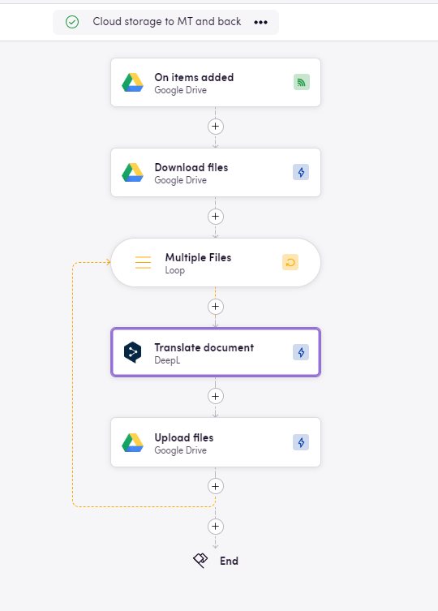
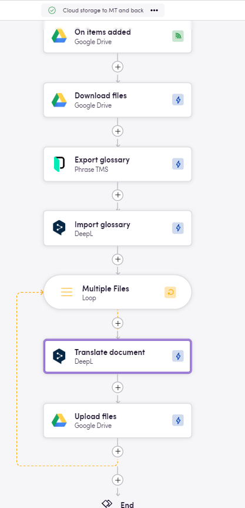
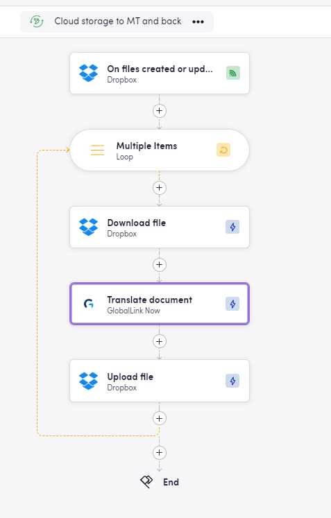
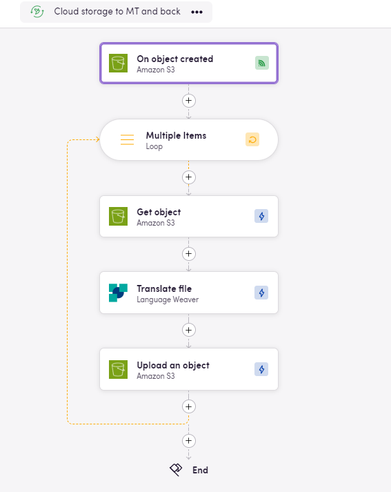

In Blackbird, Eggs are the seeds or blueprints for your workflows. They represent the initial ideas that have the potential to become fully-fledged Birds. Let's explore some options to integrate cloud storage with machine translation.

## Process Overview

1. **Trigger: File(s) Uploaded to Cloud Storage**
Users upload files to a chosen cloud storage application. This action sets our workflow into motion.
2. **File Download**
Files are downloaded from the cloud storage.
3. **Machine Translation**
The downloaded files are sent to a machine translation engine for quick processing.
4. **Translated File Upload**
Translated files are uploaded back to the cloud storage, placed in a designated output folder.

## Tips

- **Polling Events:** some apps use [polling](https://docs.blackbird.io/concepts/triggers/#polling), instead of webhooks, to detect updated/new files; check for an _Interval_ tab when setting up your trigger and choose the adecuate time for you (between 5 minutes and 7 days).
- **Glossary Integration:** Whenever the MT app allows it, users can add glossaries to enhance translation accuracy and consistency. Glossaries can be exported from a number of apps and Blackbird will guarantee interoperability (apps include TMS & CAT tools, [Microsoft Excel sheets](https://docs.blackbird.io/apps/microsoft-excel/#exporting-glossaries), [DeepL](https://docs.blackbird.io/apps/deepl/#glossaries), [OpenAI](https://docs.blackbird.io/apps/openai/#glossary-extraction)).
- **Target Language:** You can select a language from the dynamic inputs of the MT app you are using. You can also use the operators to go through a list of predefined languages (see Egg with muktiple languages at the bottom). Alternatively, you can fetch this information from another app/action. It all depends on what your process looks like.
- **Optional input:** Many MT apps will offer different parameters to be set such as dictionaries, formality, custom engine. Check the input tab for all steps.
- **Output Folder Configuration:** When uploading your files back to the cloud storage of your choice, make sure to set up a new folder so as to prevent overwriting your original files or creating an infinite loop where translated files serve as a new trigger and are reprocessed.
- **Use the correct input:** when reuploading your file, make sure to select the correct input. If you choose the exported file, then you will be reimporting the same exact file, without changes. Choose the output file from the translate action instead.
- **Loops are needed:** either to iterate through a list of target languages or to send each file within a group of downloaded files to an action that only takes one at the time, [loops](https://docs.blackbird.io/guides/loops/) are the key.
- **File renaming:** You can change the name of files before reuploading them. In case you want to append the target language code at the end of your file name, or signaled through the file name that it has been MTed, you can use the [Utilities](https://docs.blackbird.io/apps/utilities/) app or other [helpers](https://docs.blackbird.io/guides/toolbox/). There is one downloadable workflow example for this at the bottom of the page.

## Suggested Apps

### Cloud Storage

- Dropbox
- AmazonS3
- Box
- Google Drive
- Microsoft Sharepoint
- SFTP

### Machine Translation

- Language Weaver
- DeepL
- Amazon Translate
- GlobalLink NOW
- Google Translate

## Download an Egg

Download JSON workflows to import into your Nest, make any desired adjustments and **fly**.

[Sharepoint to Amazon Translate and back](../../../public/downloads/Sharepoint_to_Amazon_Translate_and_back.json)
[Amazon S3 to Language Weaver](../../../public/downloads/AmazonS3_to_Language_Weaver.json)
[Dropbox to GlobalLink NOW set multiple languages](../../../public/downloads/Dropbox_to_GlobalLink_NOW_set_multiple_languages.json)
[Dropbox to GlobalLink NOW and back](../../../public/downloads/Dropbox_to_GlobalLink_NOW_and_back.json)
[Google Drive to DeepL and back](../../../public/downloads/Google_Drive_to_DeepL_and_back.json)
[Google Drive to DeepL with Phrase Glossary and back](../../../public/downloads/Google_Drive_to_DeepL_with_Phrase_Glossary_and_back.json)
[SFTP to Google Translate with file renaming](../../../public/downloads/SFTP_to_Google_Translate_with_file_renaming.json)
