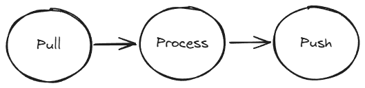

Content management systems serve as central hubs for content that may need to be localized or in other ways processed. If you are using Blackbird then there's a big chance you will want to connect with a CMS. In this guide we're going to discuss how you can think about CMS-centered workflows. Even though they are not officially classified as content management systems, certain e-commerce or PIM systems definitely have CMS-like features. You can therefore also apply this guide to these systems.

We'll first take a broader look at what common features content management systems have and what the challenges are when it comes to localization. Then we'll take a deep dive in a specific use case: Contentful.

Now let's begin!

The first thing you want to ask yourself when approaching a CMS workflow is the following: 

>_Does this CMS support localization?_ 

From our experience the answer can be one of three options:

1. Yes ([Contentful](/apps/contentful), [Zendesk guides](/apps/zendesk), [Sitecore](/apps/sitecore), [Hubspot blog posts & pages](/apps/hubspot-cms), etc.)
2. Yes, but only with the support of a popular plugin ([WordPress](/apps/wordpress), Drupal, etc.)
3. No ([Marketo](/apps/marketo), [Notion](/apps/notion), [Hubspot forms & emails](/apps/hubspot-cms), etc.)

When your CMS falls in the second or third category, a little more 'solution architecting' will have to take place in order to build the best worklfow possible with your CMS. You can also see that some apps only partially support localization natively (Hubspot), this gives extra challenges when localizing all possible content is desired.

This guide will from now on focus on the first (and most straighforward) of the three options. Later guides will take a closer look at the other options and solutions but will built on what is written here.

## 1. Concepts

A content management system generally holds (textual) content that is grouped into an **entity**. This entity is system dependent. Examples of entities are: an *article* in Zendesk, an *entry* in Contentful, a *product* in Shopify or a *blog post* in WordPress. But WordPress also has *pages* and Shopify also has blog posts. This means that a CMS can also have different types of localizable entities. 

What groups content together into an entity is generally defined as "that what is represented on a single page". We can therefore view this entity as synonimous with a user-facing page. Pages and entities also tend to have a certain hierarchy, usually defined as groups or **categories** in a CMS. This also makes it very easy to reason about entries in different groups or categories. E.g. "I want all pages in the FAQ category translated".

An entity contains content. That content is written in a language. Therefore, the entity should have a **locale** or language attribute (Note: this is exactly what is missing in content management systems that don't natively support localization). The locale attribute is incredibly important for us since it will most likely define from which entity we pull content and to which entity we push translations.

Finally, the CMS can also have supporting features that may be crucial to your localization workflow like **tags** or **custom fields**.

With just these concept under our belt we can move on to the next part: defining the core translation workflow.

## 2. Core translation workflow

At their core, all workflows involving content management systems will contain the following structure:

1. Pull content that needs to be translated.
2. Process (translate) the content into the desired locales.
3. Push the translated content to the correct entity and locale combination.

The 3 P's of CMS workflows will always find their way into your birds.

It is up to you to make the most important decisions that, together with the 3 P's, will shape your bird:

- What content should be pulled?
- Into what languages should be translated?
- What app or service will process the content?

When you have decided on these aspects, you will see that Blackbird will take care of the rest, namely:

- Automatically converting the content into an HTML file that accurately represents the entity content so it can be used for TMS in-context translation.
- Mapping language codes between different systems required to process your file.
- Waiting for long-flying processing steps or human-in-the-loop interaction (e.g. wait till the translator completes the translation).
- Automatically pushing translated content to the right entity ID as embedded in the HTML file.

## 3. Scheduled and historical localization

## 4. Continuous localization

## 5. Dealing with multiple locales

## 6. Contentful gotchas