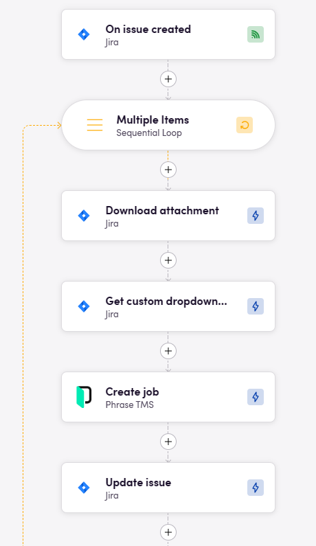
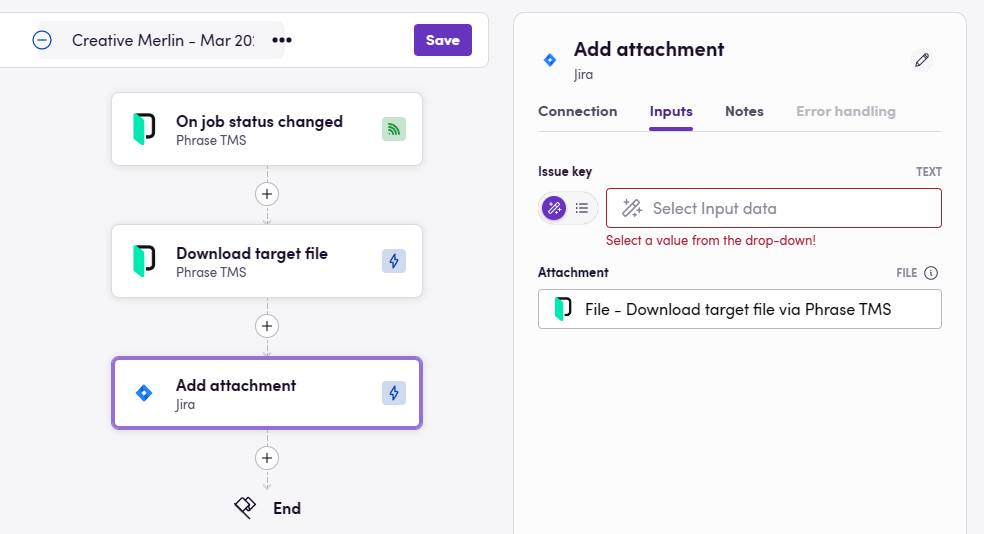
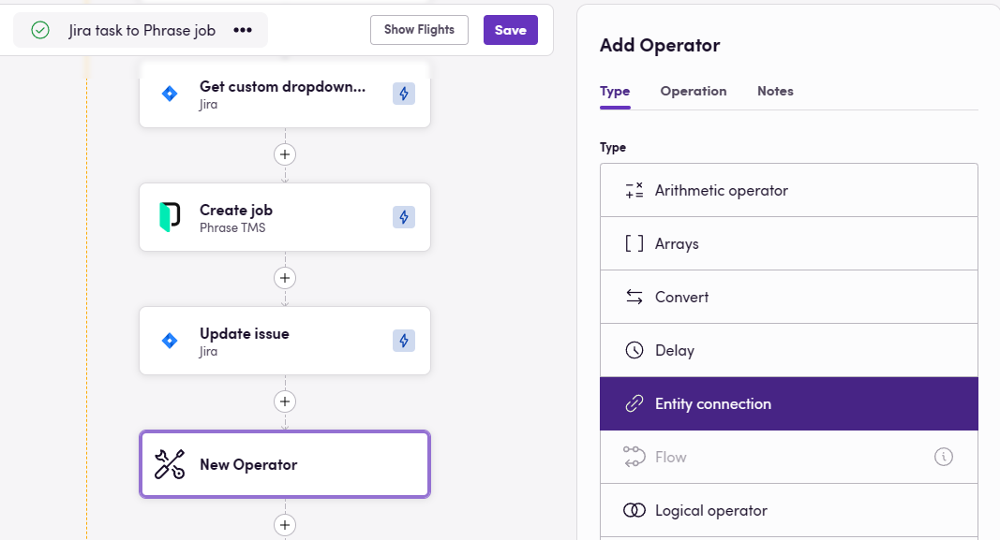
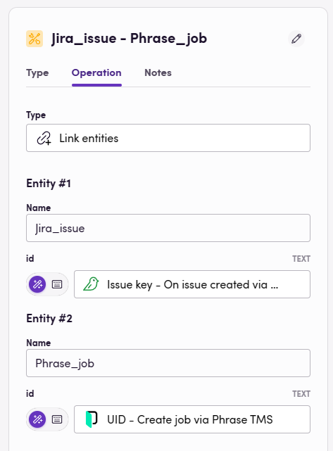
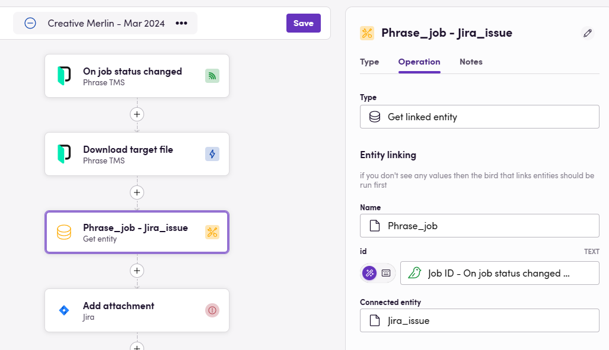
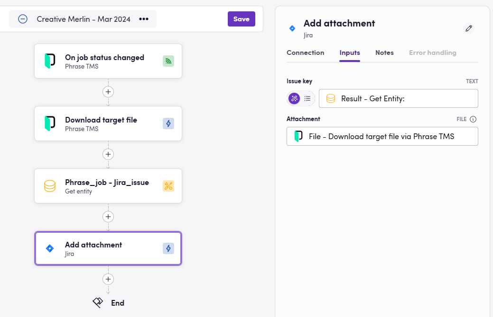

> **🚨 IMPORTANT NOTE 🚨 Always look into using [checkponts](/blackbird-docs/concepts/checkpoints/) instead of using entity linking. Checkpoints is a newer feature with the goal of completely deprecating entity linking and thus, entity linking may be removed from Blackbird in the future.** 

Now that you have learned the concept of a linked entity across different systems and platforms in the previous guide, it's time to look at how you can link entities without having to rely on a certain system's capability to store custom values. Namely, Blackbird offers you the ability to link these entities through a special operator, conveniently named _Link entities_. But first a TLDR of the previous guide:

## TLDR; what are linked entities?

When connecting different systems, we often find that something represented in one system is semantically the same as something represented in another system. Think of an article in a CMS being represtented by a file in a TMS, a customer in your BMS being represented by a customer in your CRM, or even a Slack message that represents a translation project!

If we take the CMS article <> TMS file as an example, we can identify a very common pattern: when a TMS project is created, we add files corresponding to CMS articles. Then, when the translations are completed, we will need to update each article with the correct translated file. Assuming that the translation completed workflow is different from the creation of the translation project workflow, we would have to ask ourselves the question: **given this translated file I received from my TMS, what article did it correspond to?** We need an answer to this question in order to put the translation back in the right place.

If we are not using a custom properties approach as seen in the last guide, we need to use Blackbird's native _Link entities_ operator.

> If a system allows for custom properties, we always recommend you use this over Blackbird's native linked entities so that you have more control over editing these properties if necessary.

## Our scenario

We'll go over this operator step-by-step. But let's define the workflow we are going to build first. We're going to assume that this is a disjointed workflow, meaning that part of the workflow is based on one trigger, and a second part of the workflow by another trigger. We can define it as following:

> _When a new Jira ticket is created, take the attachments and other information and add them to a Phrase job._

Then:

> _When that Phrase job is completed, update the Jira ticket and upload the translations._

Without going over the details, the first part of the workflow looks like this:

We are using a loop over all the attachments in the issue, then download the attachment and create a Phrase job out of these, together with the language that was selected from a dropdown in Jira.

Then se second part of the workflow will look like this:

We download the translated file and then we want to add it to our Jira ticket. However, we are now confronted with the exact same problem we mentioned earlier: **given this completed job, what issue did it correspond to?**

> All use cases for entity linking take on this same form: _x_ corresponds to _y_, I have _x_, what is _y_?

## 1. Linking the entities when they are created.

In order to answer this question, we need to add one more step to our first workflow. Namely, we need to establish the link between these two entities.

Click on the `+` icon and select _Operator_. Then on the menu on the right, select _Entity connection_.

Then for type select _Link entities_. We now have to define the names and the IDs of our two entities. We recommend using recognizable names. In our case we use `Jira_issue` and we select the _Issue key_ (which is the ID for the issue which we'll want in our second bird), and we link it to `Phrase_job` and add the _UID_ of the Phrase job we just created.

Done! We can now fly this bird and verify that it does so succesfully. When we have added the _Link entities_ operator to our bird we can now make use of this link in our other bird.

> **Note**: You have to fly a bird with a link entity at least once succesfully for the entity names to appear in the next step!

## 2. Using the entity link.

Let's return to the bird responsible for putting the translations back into Jira. Between the Phrase and Jira actions we can now add the _Entity connection_ operator again. This time, instead of choosing _Link entities_ as its type, we will choose _Get linked entity_.

When we click on _name_, we will see a dropdown with all the different entity types that Blackbird stored for you. We know that we havea Phrase job and we want a Jira issue, therefore, we select `Phrase_job` and fill in the Job ID we received through the event. Then for connected entity, we select `Jira_issue`.

Hooray! We have now retrieved the linked entity!

We can now use this ID (which in our case represents the Jira issue key) in our final action to complete the bird.

Et Voila, when the Phrase job is completed, we now see our attachments returned in the correct Jira ticket! 🎉

> We will be working on a feature later this year that may actually replace a lot of these scenarios with disjointed workflows. We're looking to add so called _in-bird-events_ that will allow you to continue a disjointed worklow as if it was one. In most (if not all) cases this may remove the need for entity linking.
