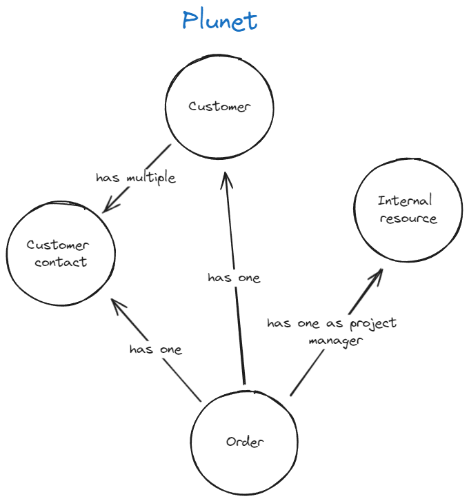
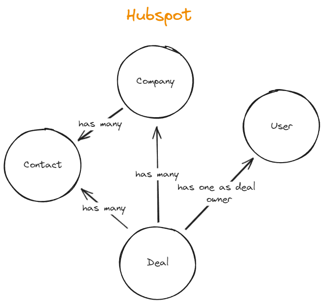
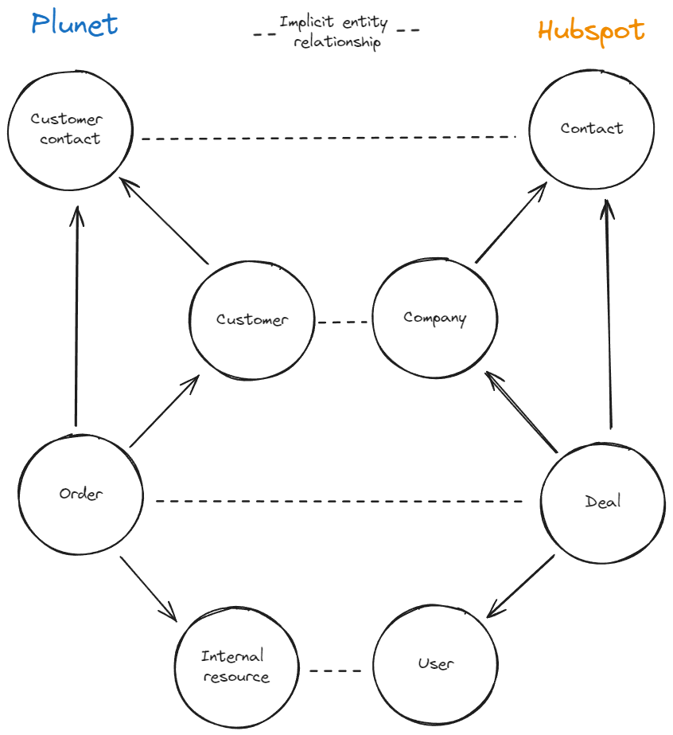
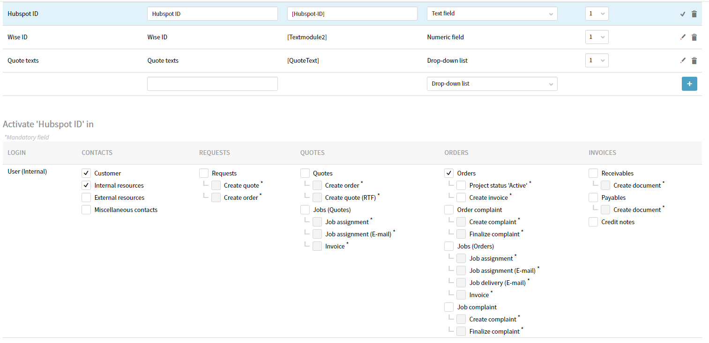
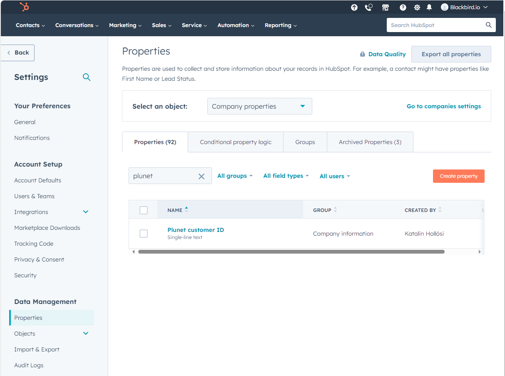

This guide is our first introduction to business process management and solution architecting. Now that you know how to use the basic functionality (birds, flights and apps) it is time to learn the soft skills that will help you get the most out of Blackbird!

Data synchronization between two systems is a typical Blackbird use case. Usually the requirements would be in the shape of: "When a new _x_ is created in system _y_ synchronize it to system _z_".
Today we are taking Plunet and Hubspot as example systems for this case, but of course the same methodology can be applied to any two other systems.

> Note: Throughout this article, wherever we refer to Plunet order it can be substituted by Plunet quote or Plunet request, equially you can choose to link with Hubspot Quotes instead.

## 1. Requirements

As any experienced software developer will tell you: getting accurate requirements is hard. This is because in software land, everything can be precisely defined but in human language land, we tend to be a lot _"freer"_ in our descriptions of what we want to achieve. Let's take a look at a real-life example of a Blackbird user's requirement:

> "We want to synchronize Plunet orders with Hubspot deals"

This requirement is still a long way from an actual bird. So the first step is to get more details. Assuming we already know what Plunet orders and Hubspot deals are, we need to find an answer to the two most relevant questions: **What** data needs to be synchronized and **When** should this synchronization take place?

> "We want to create a deal in Hubspot when an order is created in Plunet. The deal amount, name, customer, contact person and project manager should be synchronized"

That's more like it. Whether you are implementing your own workflows in Blackbird, or you are working with someone else's requirements, you need to be able to articulate **What** needs to happen **When**. If this business process is actually already being executed "manually" on a periodic basis, then it can be extremely valuable to (digitally) sit next to this person as they do their actions. It can help finding hidden requirements, but also already give you a head start on the steps we need to take next. In all cases it is recommended that a requirement can at least be executed manually, even if it is not part of any business process today.

## 2. Relationship mapping

Now that we have a better grasp of what we need to build, we need to get some bearings on how these systems work. What is a customer in Plunet? What is an order? And most importantly: **what are the equivalent representations in Hubspot?**

Let's start with Plunet, but let's be brief:

- There are multiple customers.
- Each customer can have multiple contact persons.
- Plunet has 'internal resources' which represent people in your organization.
- There can be multiple orders, each representing business negotiated with a customer.
- A Plunet order is linked to an 'internal resource' as project manager, a customer and a contact person of that customer.

In Hubspot, thinks look similar but with a significant difference:

- There are multiple companies
- There are multiple contacts
- There are multiple deals. A deal has a 'deal owner' who is a Hubspot user
- Between these three entities, many-to-many relationships exist. And Hubspot uses 'associations' to keep track of these relationships.

These structures are similar enough to create a mapping between the two. However, in some cases these similarities don't exist. In those cases it is prudent to investigate how people have mapped these relationships in their organization.

Let's draw the semantic relationship map:

## 3. Implementating the relationships

Whenever we are dealing with semantic relationships, we also need to make them explicit. We are doing this so later down the line we can easily have answers to questions of the form **"I have entity _x_, how do I now get entity _y_?"**. For example, we know that we will have actions within one system to get certain relationships. Given a Plunet order I can easily get the project manager. Given a Hubspot company I can easily get the contacts. These relationships and actions come out of the box! But how should we map the implicit relationships we just defined? Given that I have a Plunet order, how do I get the equivalent company _in Hubspot_?

Somewhere, references to the other equivalent entity need to be stored. Luckily, both Plunet and Hubspot allow us to create and set custom fields for each of these entities.

For Plunet, we create a _text module_ and apply it to Customers, internal resources, and orders. The name of the text module will be _Hubspot ID_ so that we can save the Hubspot IDs of equivalent entities. For more information on text modules, see the [Plunet documentation](https://kb.plunet.com/display/KB/Text+modules).

In Hubspot, every entity can also have _Custom properties_ (Settings -> Data Management -> Properties). We can create a new property on each of our relevant entities. For more information on custom properties, see the [Hubspot documentation](https://knowledge.hubspot.com/properties/create-and-edit-properties)

We have not created the infrastructure required to semantically link the entities in our two separate systems and we're ready to move on to the next step!

## 4. Planning the bird

Let's remind ourselves of the workflow we are trying to automate:

> "We want to create a deal in Hubspot when an order is created in Plunet. The deal amount, name, customer, contact person and project manager should be synchronized"

We have arrived at the most important step that you take before building the bird: breaking a problem down into small steps. The strategy that can most often be applied for typical Blackbird workflows is _what steps would a person take in order to execute this workflow manually?_ - while already assuming the previous 'infrastructure' that we created. If there is no way that one can envision a workflow being executed manually, then there is no way that we can instruct Blackbird to do it either. Therefore the manual steps are the basis of our automation.

Let's write down the manual steps that one needs to perform in order to synchronize their Plunet order to a Hubspot deal. We assume that the order has already been created.

- Create a new deal in Hubspot and fill in from our Plunet order:

  - The total price from Plunet should be filled in for the amount
  - The order name from Plunet should be the deal name
  - The order date from Plunet should be the closed date
  - The Plunet order ID should be set as the Plunet ID custom property

- After creating the deal, get the Deal ID from Hubspot and add it to the Hubspot ID text module in Plunet
- Go to the customer of the order in Plunet and find its Hubspot ID from the text module
- Create a new association between this Hubspot customer and the Hubspot deal
- Go to the contact of the order in Plunet and find its Hubspot ID
- Create a new association between the Hubspot contact and the Hubspot deal

> You may wonder why we are filling the custom properties and text modules while they are not necessarily required for this bird. We recommend that it as good practise to create these associations for future workflows and scenarios.

So it seems that our bird is going to be pretty straightforward! We perform about 6 actions when manually synchrnozing Plunet to Hubspot, we can thus expect a bird of about equal size.
