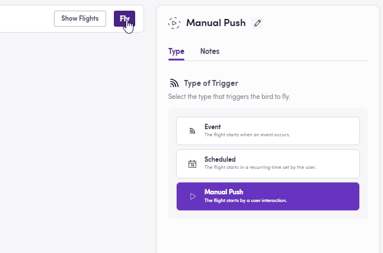
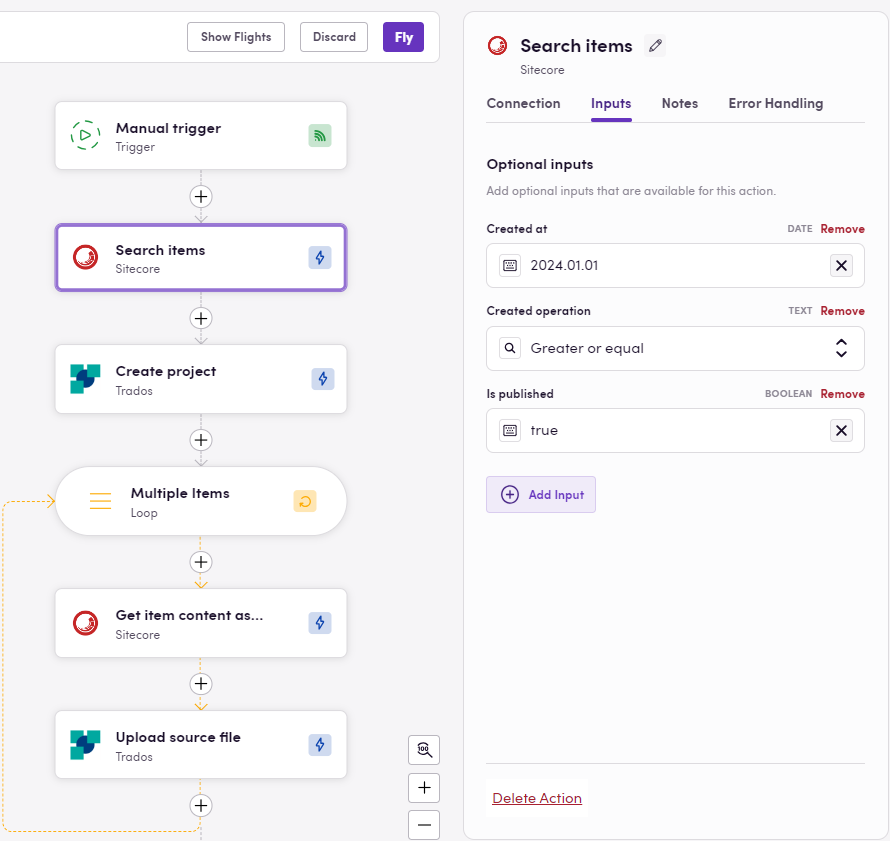

Manual triggers (also referred to as Manual push) offer a powerful solution for workflows that require flexibility and human intervention. Unlike automated processes, manual triggers allow users to initiate a workflow exactly when needed by clicking the Fly button. This feature is particularly useful for any user that needs to start tasks based on specific conditions or human judgment. Whether it's for testing new Birds, debugging workflows, or handling one-off projects, manual triggers give you control over the timing and initiation of processes, ensuring tasks start when you're ready.

A key advantage of manual triggers is the flexibility they provide. Instead of being tied to rigid, scheduled workflows or waiting for an event to react to, you can activate processes on demand, making them ideal for situations where unpredictable conditions require human discretion. This makes manual triggers the perfect choice during the development phase of a workflow. As you build and refine your Birds, manual initiation lets you test various elements without waiting for a scheduled or event trigger, providing real-time feedback and helping ensure a smooth process before full automation is applied.

Manual triggers also shine in the localization and content processing space. As an example, when a language service provider takes on a new client or project, there’s often a need to translate or process plenty of legacy or pre-existing selected content in a one-off capacity. Manual triggers allow you to set the necessary filters in the app from which the content is sourced, such as date ranges or content categories, and then, with a single click, extract and send it to your platform or TMS. This ensures a seamless, efficient process before transitioning into continuous localization services.

### Example

The image above shows a Bird that moves a large group of Sitecore pages meeting specific criteria into a TMS (Trados in this case). Once the user clicks the Fly button — the manual trigger — the workflow begins. The Bird searches for all pages in Sitecore created after January 1st, 2024, that are published. The optional input filters have been used to customize the search criteria, making it easy to adjust them as needed. These filters help identify which pages to download. The subsequent steps in the workflow create a project in Trados, retrieve the Sitecore pages as HTML files, download them, and upload them into the newly created Trados project as source content for translation. This workflow can be executed as many times as necessary by clicking the Fly button, although one execution should be enough to pull all the required content for translation and push it into the TMS of choice.

> See more information about triggers [here](https://docs.blackbird.io/concepts/triggers/).