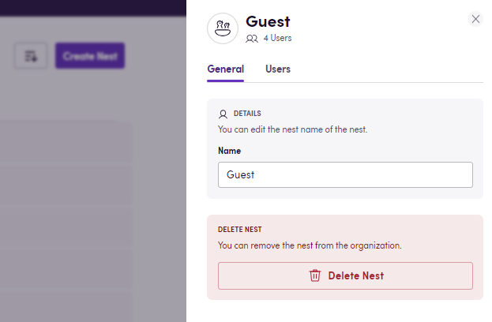
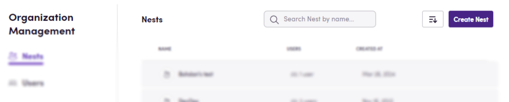
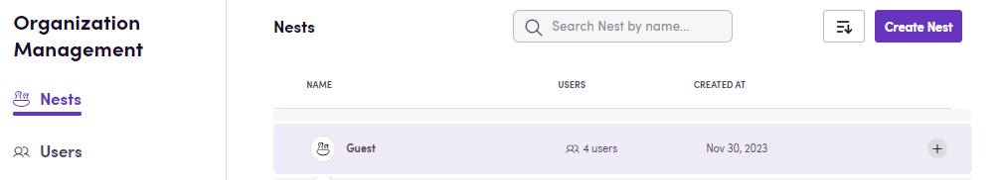
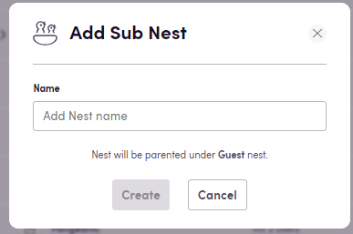
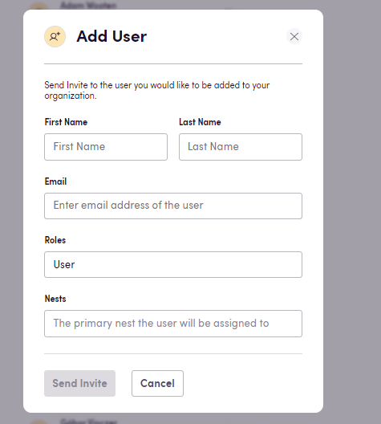
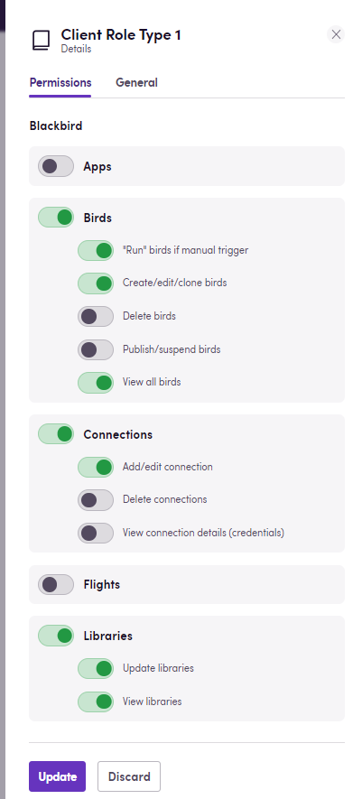
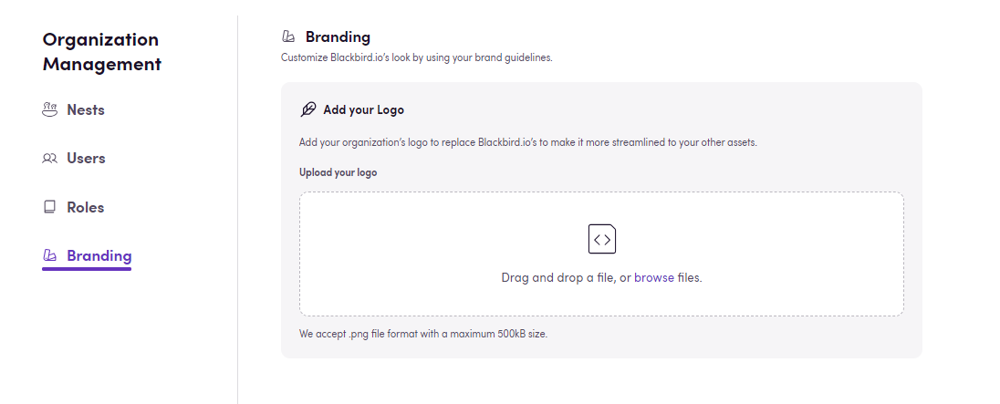

In this guide you will learn about Nests: Blackbird's way to compartmentalizing your processes, credentials and users. 

> As an administrator with access to your Blackbird account, you have the power to create multiple Nests, users, and roles to suit your organizational needs. Navigate to Organization Management to access these options.

## Nests

Keeping your data separated not only fortifies security measures but also enhances productivity as a clear delineation of data compartment eliminates unnecessary clutter. Consider creating a separate Nest for each of your clients or per stage of your workflow design process (playground, QA, production) - or even both as Nests can also have subnests for further organization. On the top right, click on your profile picture and select Organization Management. The first option on the left is Nests, you will see a list of the existing Nests under your organization along with their names, total users and creation date. By clicking on a specific Nest, you will see more details, such as each user that has been added, and you also have the option to delete said Nest.

At the top, you'll find a 'Create Nest' button to establish a new compartment.

If you want to add a subnest under an existing one, simply click the plus sign at the end of the Nest's row. 

Subnests inherit apps' credentials from their parent Nest. You may want to have one Nest for Client 1, add their credentials for the required apps to this Nest, and then create subnests for the different work stages. The users with access to the subnests will be able to connect to these apps, make them part of their workflows while choosing the credentials you have added to the parent Nest, however they won't be able to manage (or see the details of) said credentials. This means you only need to enter information once, as it is automatically inherited by subnests.

## Users

You can also define who has access to each of these instances and what they can see or do, keeping a very granular access control. On the Users tab, you can see all the people that have been invited to your organization, their role and status. On the top right, you can choose to _Add User_. You will need to fill in their name, email address and choose the appropriate role(s) and Nest(s) they will be able to access. Once you add a user, they will receive an e-mail invite prompting them to generate a password to access Blackbird.

## Roles

By default, you will see User and Admin roles as available options. However, this can be tailored to align with specific responsibilities and access requirements. Roles can be edited (by clicking on the specific role you want to update), deleted or created from scratch. To create a new role, simply click on _Add role_, provide a name for this role and choose which permissions you want to grant. 

As an example, you may want to invite one of your clients to your Blackbird instance and give them a "Client" role that only entitles them to add their credentials to connect to an app. This way you avoid data manipulation or sharing. You may have clients that need a more _empowered_ role because they want to review processes, for this purpose, you can give them a broader but read only access. Or you may want to have a more collaborative approach and enable them to build workflows with you. All of this is possible and, just like everything else at Blackbird, you define it. 

## Branding

Finally, there is a whitelabelling option under the _Branding_ tab that allows you to upload your own logo (to replace Blackbird's on the top left corner) and customize your instance's look. 

