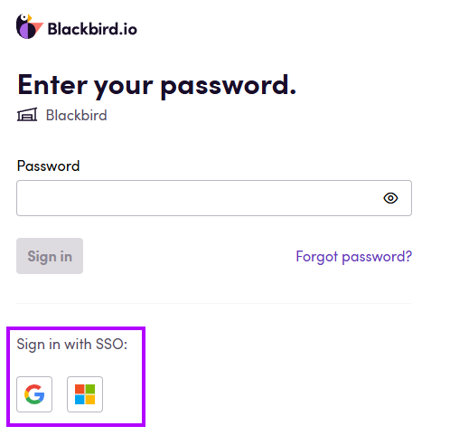

Single Sign-On (SSO) solutions offered by Google and Microsoft provide a seamless and secure way to manage authentication across multiple applications. By enabling users to access various platforms with just one set of credentials, SSO simplifies the login process, reduces the risk of security breaches, and minimizes password fatigue. This not only enhances security but also improves user experience, boosting productivity and efficiency across your organization.

#### Simplified Sign-In with Blackbird's Flexible Authentication Options
At Blackbird, we offer flexible sign-in options to suit your needs. You can either log in using a unique ID and password or take advantage of the convenience provided by SSO. To further streamline your experience, Blackbird features automatic account linking. If your email address with an SSO provider (such as Google or Microsoft) matches the email address associated with your Blackbird account, you can effortlessly sign in using SSO without any additional setup. This ensures a smooth and hassle-free login experience, allowing you to focus on what matters most.

**To sign in using SSO:**

On the sign-in screen, select the Google or Microsoft button after entering your email address.

This action will open the selected service and prompt you to sign in, if you haven't done so already.

If multi-factor authentication (MFA) is enabled, you will also need to complete the secondary authentication step.

Once you're signed in, Blackbird will verify whether your Microsoft or Google email address matches the email address associated with your Blackbird account. If they match, you'll be granted access to your Blackbird instance.