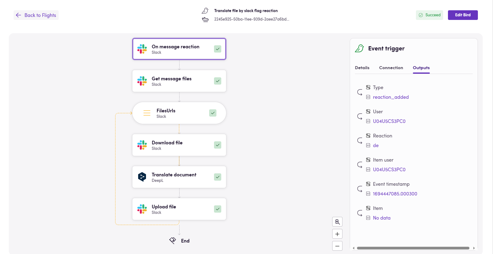

A Flights fül áttekintést nyújt arról, hogyan teljesítenek a Madarai. A lista az elmúlt harminc nap legutóbbi 500 repülését jeleníti meg. A keresősávban szűkítheti az eredményeket a Madár nevének vagy a Flight azonosítójának beírásával. Szűrheti a listát a legutóbbi, sikertelen, folyamatban lévő vagy sikeres repülések szerint is.

## Egy repülés részleteinek ellenőrzése

A repülések ellenőrzéséhez navigáljon a _Flights_ fülre, és kattintson egy repülésre a listában a részletek megtekintéséhez. Ebben az áttekintésben ellenőrizheti az egyes műveleteket, azok bemeneteit és kimeneteit. Üzenetet fog látni, ha egy művelet sikertelen volt.

A _Szerkesztés_ gombra kattintva megnyithatja az aktuális Madár szerkesztőoldalát, ahol elvégezheti a szükséges módosításokat.

