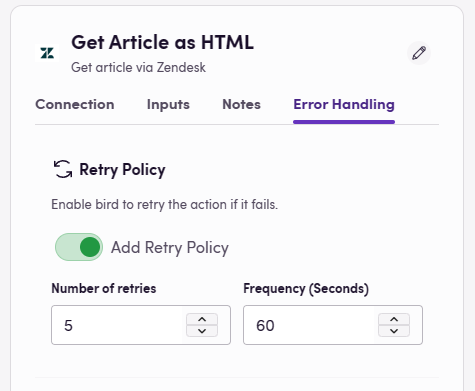
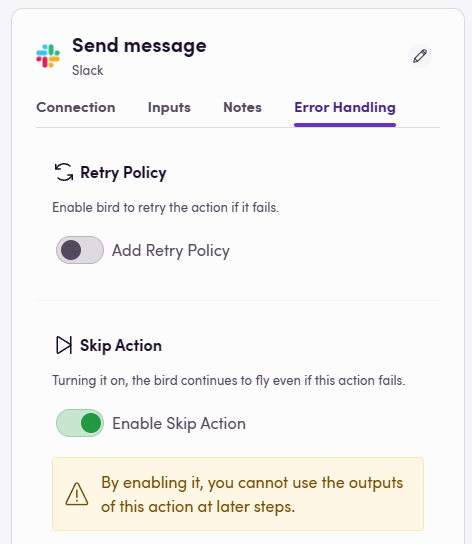

A hatékony hibakezelés kritikus komponense lehet bármely munkafolyamat-vezérlőnek. A Blackbird több módot is kínál a hibák kezelésére, amikor azok előfordulnak. Ez az útmutató végigvezeti a Blackbird hibakezelésének három fő szempontján: Újrapróbálási szabály beállítása, műveletek átugrásának engedélyezése hiba esetén, és madár futtatása bármilyen madár hibája esetén (ez a funkció jelenleg még nem érhető el).

## Újrapróbálási szabály

Az, hogy egy munkafolyamat hogyan kezeli a hibákat, nagy hatással lehet annak általános teljesítményére. Az átmeneti problémák miatt meghiúsult műveletek újrapróbálása gyakran segíthet befejezni egy olyan munkafolyamatot, amely egyébként elakadhatna.

Újrapróbálási szabály beállítása a Blackbird-ben:

1. Egy műveletből navigálj az '_Error handling_' (Hibakezelés) fülre.
2. Határozd meg az újrapróbálások maximális számát a '_Number of retries_' (Újrapróbálások száma) mezőben.
3. Add meg az újrapróbálási időközt a '_Frequency (Seconds)_' (Gyakoriság (másodperc)) mezőben.

A madár most megpróbálja újra végrehajtani a műveletet a megadott számú alkalommal és a meghatározott időközönként, ha hibát észlel.

### Mikor használjunk újrapróbálási szabályt

Azt gondolhatnánk, hogy érdemes minden művelethez újrapróbálási szabályt alkalmazni a madárban "biztos, ami biztos" alapon. Ez sajnos nem így van a következő okok miatt:

- Az újrapróbálási szabály extra API-használati költséget vonhat maga után.
- Egy jól felépített alkalmazásnak már alapvetően kezelnie kellene az újrapróbálásokat olyan gyakori esetekben, mint például a sebességkorlátozások.
- Egy mellékhatással járó művelet újrapróbálása logikai problémákat okozhat a csatlakoztatott rendszerekben. Például, ha a művelet új projektet hoz létre egy rendszerben, akkor hirtelen több projekt is létrejöhet, mert az alapul szolgáló hiba a projekt létrehozása után következett be. Technikai értelemben figyelembe kell venni az _idempotenciát_.

Ez még mindig nyitva hagyja a kérdést, hogy mikor érdemes használni az újrapróbálási szabály funkciót. Általános irányelv, hogy akkor ajánlott újrapróbálási szabályt hozzáadni, amikor feltételezhető, hogy a rendszer, amelyhez csatlakozunk, bizonyos forgatókönyvekben instabil lehet, és a madár tesztelése során arra a következtetésre jutunk, hogy az újrapróbálási szabály hozzáadása kevésbé nehézkessé tenné a madár üzemeltetését.

Tehát egy újrapróbálási szabály hozzáadása olyan művelethez, amely néha azért hibásodik meg, mert egy szerver túlterhelt, miközben maga a művelet nem hoz létre új entitásokat ebben a rendszerben, jó gyakorlat. Nem ajánlott újrapróbálási szabályt hozzáadni olyan művelethez, amely azért hibásodhat meg, mert egy felhasználó rosszul konfigurált egy bizonyos értéket, mivel a művelet újrapróbálása soha nem fog jó eredményt hozni, és ebben az esetben gyakran jobb, ha hamarabb, mint később értesülünk a problémáról.

## Művelet kihagyása hiba esetén

Előfordulhatnak olyan esetek, amikor hiba léphet fel, és szeretnéd, ha a munkafolyamat ettől függetlenül továbbhaladna. Ilyen helyzetekben kihagyhatod a sikertelen műveletet, és folytathatod a munkafolyamat többi részét.

Ennek engedélyezéséhez:

1. Keresd meg a kívánt műveletet a munkafolyamatban, majd menj az '_Error Handling_' (Hibakezelés) fülre.
2. Kapcsold be az '_Enable Skip Action_' (Művelet kihagyásának engedélyezése) opciót.

Most, ha ez a konkrét művelet hibát okoz, átugrásra kerül, lehetővé téve a munkafolyamat folytatását.

> **💡 Megjegyzés**: Amikor engedélyezed a művelet kihagyását, ennek a műveletnek a kimeneti értékei nem használhatók máshol a madárban.

### Mikor hagyjunk ki egy műveletet hiba esetén

A művelet kihagyási képesség tökéletesen működik nem létfontosságú munkafolyamat-lépéseknél. Pl. olyan lépések, amelyek nem létfontosságúak a munkafolyamatod helyes végrehajtásához, mint például naplózás, értesítések, állapotfrissítések stb. A felhasználó dönti el, mely műveletek nem kritikusak és megengedhető, hogy kihagyásra kerüljenek.

## Hibakezelés

Még az újrapróbálási szabályokkal és a műveletek kihagyásával is előfordulhat, hogy a dolgok meghiúsulnak. A Blackbird filozófiájához ragaszkodva lehetővé akartuk tenni számodra, hogy teljesen testreszabhasd, mi történjen egy sikertelen repülési esemény során. Ezért használhatod a Blackbird alkalmazást olyan madarak létrehozására, amelyek sikertelen repülésekre indulnak, így pontosan meghatározhatod, hogy mit szeretnél tenni. Mivel teljes szabadságod van, választhatod például, hogy üzenetet küldesz magadnak Slack-en, létrehozol egy Jira jegyet (vagy bármilyen más feladatkövetési eszközt használsz), e-mailt küldesz, adatbázisba naplózol, vagy akár ezek kombinációját! Talán még vissza szeretnéd vonni néhány változtatásodat is.

Ez a hihetetlenül egyszerű madár értesítést küld a Slack-en, amikor bármely repülés sikertelen. Ez hasznos lehet az emberek figyelmeztetésére a lehetséges problémákról. Egy alternatív vagy kiegészítő művelet a Slack helyett lehetne például egy jegy naplózása a Jira-ban.

Többet olvashatsz a hibakezelő madarak beállításáról a [Blackbird alkalmazás oldalán](../../apps/blackbird/)

## Záró megjegyzések

A hibák kezelése a munkafolyamat-tervezés kulcsfontosságú szempontja. A Blackbird-nél elkötelezettek vagyunk amellett, hogy biztosítsuk a szükséges eszközöket a munkafolyamatok hatékony kezeléséhez, még akkor is, ha a dolgok rosszul mennek. Tartsd szemmel ezt az útmutatót a jövőbeni frissítésekért, ahogy folyamatosan fejlesztjük a platformunkat. Mint mindig, ha segítségre van szükséged vagy kérdéseid vannak, kérjük, fordulj a támogató csapathoz.