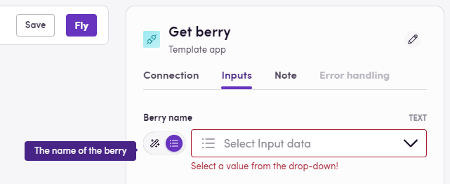

Az SDK segítségével olyan műveleteket határozhat meg, amelyeknek meg kell jelenniük az alkalmazásában. Más munkafolyamat-szervezési platformokkal ellentétben a Blackbird műveletei nem feltétlenül felelnek meg 1:1 arányban egy végponttal. Gyakran módosítjuk a műveletet, hogy felhasználóbarátabb legyen és/vagy extra funkciókat adunk hozzá a kényelem érdekében.

## A Blackbird irányítása a műveletekhez

A Blackbird projektben a műveleteket egy olyan osztály metódusaiként definiáljuk, amely rendelkezik az `ActionList` attribútummal. Ezeknek a metódusoknak szükségük lesz az `Action` attribútumra. Egy művelet alapvető szerkezete a következőképpen néz ki:

```cs
// Hogy a Blackbird számára látható legyen, add hozzá az [ActionList] attribútumot
[ActionList]
public class MyActions : BaseInvocable
{
  // [...]

  // Az osztály minden [Action] attribútummal rendelkező metódusa látható lesz műveletként a Blackbird-ben
  [Action("Translate", Description = "Translate a string")]
  public async Task<TextResult> Translate([ActionParameter] TextTranslationRequest request)
  {
    // Itt csinálj valamit a kéréssel

    return new TextResult{ Translation = "My translation" }
  }
}
```

Az `ActionParameter` attribútumokat használó metódusok argumentumai a művelet bemeneti paraméterei a Bird szerkesztőben. Ha a műveletnek nincsenek bemeneti paraméterei, az argumentum hiányozhat.

Az `Action` attribútum első argumentumként egy karakterláncot vesz fel. Ez lesz a művelet megjelenített neve a Blackbird-ben. Megadhat egy opcionális Description argumentumot is, amely megjelenik a Blackbird-ben.

A kimeneti osztályban lévő mezők automatikusan elérhetővé válnak a Bird szerkesztőben a következő lépésekben. A művelet metódusok lehetnek aszinkronok - de ez nem követelmény.

> Megjegyzés: A művelet metódus neve nem változtatható meg, a Blackbird ezt törölt és újonnan létrehozott műveletként értelmezné.

## Bemeneti értékek megjelenítési neveinek meghatározása

Az `[ActionParameter]` attribútum bármilyen elfogadható argumentumhoz (karakterláncok, számok, logikai értékek, dátumok, listák), de osztályokhoz is hozzáadható. Az osztályhoz adva a Blackbird egyszerűen megjeleníti az osztály összes tulajdonságát bemeneti argumentumként.

A `[Display]` attribútum használható mind az osztály tulajdonságain, mind a bemeneti argumentumokon, hogy meghatározza, hogyan jelenjen meg a változó a Blackbird felhasználói felületén. Ezenkívül leírás is megadható.

```cs
public class GetBerryRequest
{
    // A tulajdonságoknak rendelkezniük kell display attribútumokkal, amelyek tartalmazzák a változó felhasználóbarát nevét
    [Display("Berry name", Description = "The name of the berry")]
    public string BerryName { get; set; }
}
```

Ez az osztály a következőképpen alakul át:



Csakúgy, mint a bemeneti argumentumoknál, a `[Display]` attribútum a műveletek visszatérési típusainál is működik, hogy felhasználóbarát neveket adhasson nekik.

### Attribútumok figyelmen kívül hagyása

A `[DefinitionIgnore]` attribútumot használhatja egy tulajdonság elrejtésére, hogy ne jelenjen meg a Blackbird-ben.

```cs
public class BerryResponse
{
    [Display("Berry ID", Description = "The ID of the berry")]
    public string Id { get; set; }

    [Display("Berry name", Description = "The name of the berry")]
    public string Name { get; set; }

    [DefinitionIgnore]
    public string InternalReference { get; set; }
}
```

## Opcionális bemenetek

Alapértelmezés szerint minden bemeneti paraméter kötelező a Blackbird felhasználói felületén. Bármely bemenetet opcionálissá tehet egyszerűen azzal, hogy a értéket nullázhatóvá teszi (`?` C#-ban).

```cs
public class CreateCallbackRequest
{
    // Ez a bemenet most opcionális
    [Display("Action")] public string? Action { get; set; }
    [Display("Callback URL")] public string CallbackUrl { get; set; }
}
```

## A kapcsolat használata

Most, hogy tudjuk, hogyan definiálhatunk egyéni kódot, amely egy művelet hívásakor fut, használjuk a kapcsolatot, amelyet korábban definiáltunk.
A Blackbird-ben bármely osztály örökölhet a `BaseInvocable`-ből. Amikor ez megtörténik, a Blackbird átadja a meghívási kontextust ennek az osztálynak, amikor példányosításra kerül. A kontextus hasznos információkat tartalmaz, mint például a Bird ID, Flight ID, de ami a legfontosabb: a hitelesítési adatokat.

```cs
[ActionList]
public class MyActions : BaseInvocable
{
  // Hozzon létre egy konstruktort, amely átadja az InvocationContext-et
  public MyActions(InvocationContext invocationContext) : base(invocationContext) {}

  [Action("Translate", Description = "Translate a string")]
  public async Task<TextResult> Translate([ActionParameter] TextTranslationRequest request)
  {
    var credentials = InvocationContext.AuthenticationCredentialsProviders;

    // Használja a hitelesítési adatokat egy API kérés küldéséhez

    return new TextResult{ Translation = "My translation" }
  }
}
```