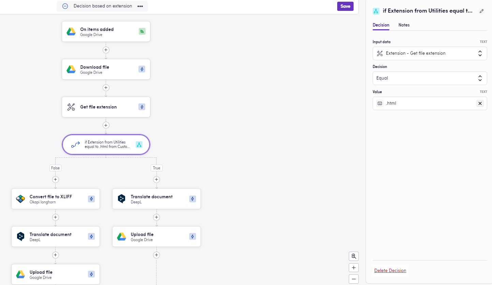
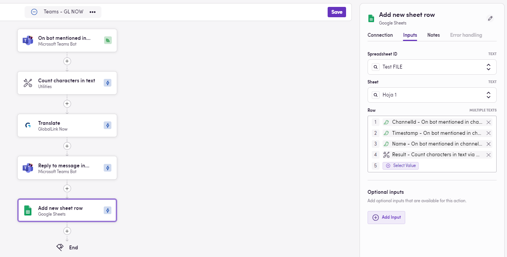
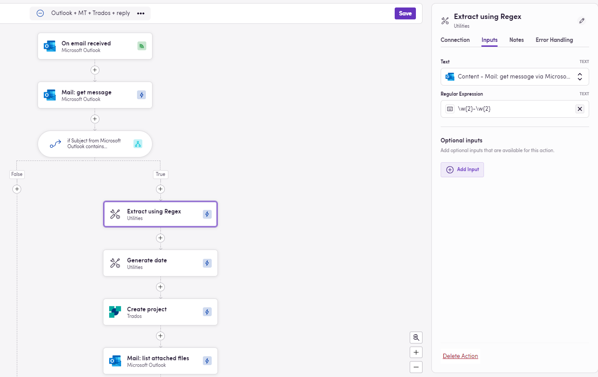
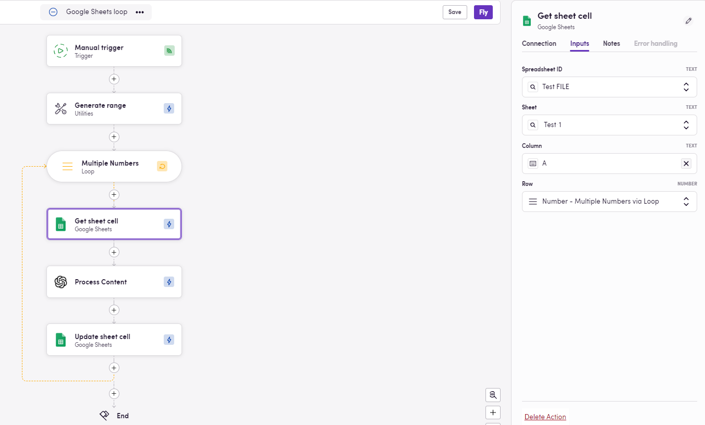
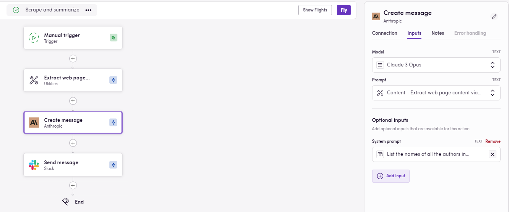
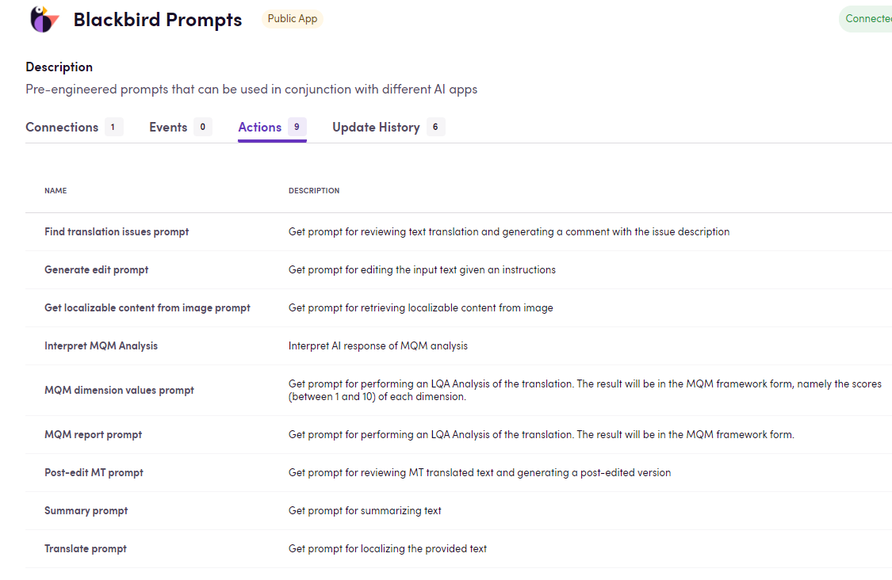
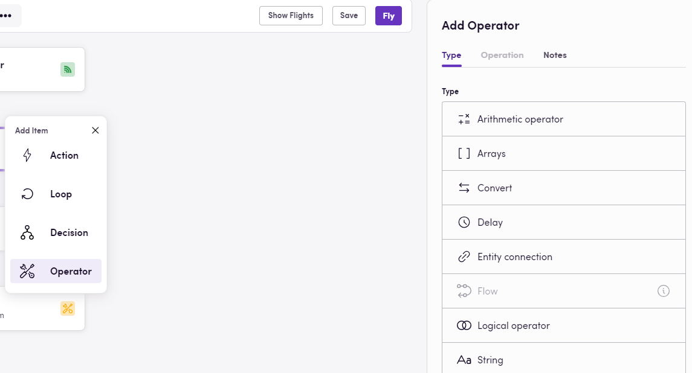
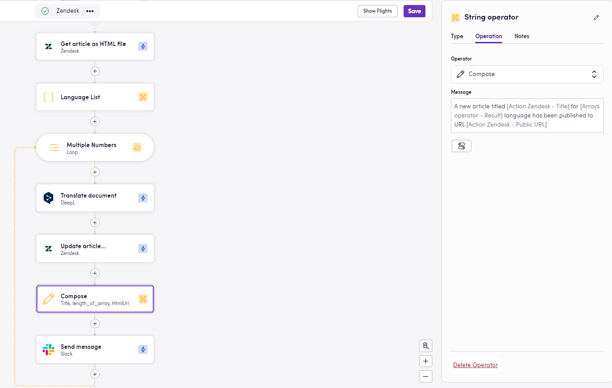

Bij het navigeren tussen apps in een workflow kan het zijn dat u extra acties moet uitvoeren om gegevens op verschillende manieren aan te passen en te transformeren. Hier zijn enkele Blackbird-tools die u helpen te slagen.

## Utilities app

De [Utilities](https://docs.blackbird.io/apps/utilities/) app biedt een breed scala aan acties om u te helpen uw gegevens te beheren. Hier zijn enkele voorbeelden:

- Datums: 
    - U kunt een datum genereren (bijv. vandaag) en dagen toevoegen/aftrekken (al dan niet rekening houdend met werkdagen). Dit kan zeer handig zijn voor het instellen van deadlines of het creëren van dynamische datums voor het opvragen van gegevens. U kunt uw datum ook op verschillende manieren formatteren.
- Bestanden: 
    - U kunt de naam van een bestand extraheren en zelfs wijzigen - u wilt misschien de naam van de taal waarin u het bestand vertaalt toevoegen aan de naam van het bestand. 
    - U kunt ook de extensie van een bestand krijgen, wat zeer nuttig zou zijn als u bestanden van verschillende types naar verschillende paden moet routeren. 
    
    - U kunt het aantal woorden of tekens in een bestand tellen. Misschien moet u bijhouden hoeveel tekens er naar uw MT-engine worden gestuurd omdat u op basis hiervan wordt gefactureerd, dan wordt het een waardevol gegeven om te extraheren en op te slaan. 
- Tekst:
    - Het is ook mogelijk om woorden en tekens te tellen in tekstformaten. Dus als u een bericht oppikt van Slack of Teams, of als u wilt weten hoe lang een bestandsnaam is, kunt u de acties in Utilities gebruiken om deze te tellen.
    
    - Reguliere expressies kunnen worden gebruikt om content te extraheren of te vervangen in tekst. Bij het extraheren van content kunt u als optionele parameter het groepsnummer specificeren dat u specifiek wilt extraheren. Of u kunt groepering gebruiken met de vervangingsactie om delen van uw tekst te hergroeperen. Met deze opties kunt u e-mailadressen uit een bericht of een lijst met taalcodes uit een e-mailbericht extraheren. 
    
- Bereik van getallen:
    - Door een begin- en eindpunt op te geven, kan een reeks getallen worden gegenereerd. Dit is bijzonder nuttig in combinatie met een Loop omdat u een actie een X aantal keren moet herhalen. Een goed gebruiksvoorbeeld is het itereren door de rijen van een tabel (denk aan Microsoft Excel) en informatie ophalen uit kolom A, deze verwerken en uiteindelijk het resultaat in kolom B plakken. In dit scenario kunt u de getallen in het bereik gebruiken om het rijnummer aan te geven.
    
- Arrays:
    - Er zijn ook een paar nuttige opties om te werken met arrays of groepen items. Met de actie "Array Contains" kunt u controleren of een waarde in de array is opgenomen of niet, en beslissingen nemen op basis daarvan. Bijvoorbeeld, een van uw klanten bestaat niet in uw lijst met contacten, daarom kunt u deze toevoegen zonder duplicaten te maken. 
    - Over duplicaten gesproken, er is ook een actie om een lijst met unieke waarden terug te geven op basis van een array als invoer. 
- Scraping:
    - Ruwe en ongeformatteerde webpagina-inhoud kan worden geëxtraheerd uit een URL. U kunt ook een XPATH opgeven om de exacte content te specificeren die moet worden geschraapt. Dit is vooral handig als u content van een webpagina moet halen maar geen toegang hebt tot het CMS of de broncode.
    

- XML-bestanden:
    - Als u werkt met XML-bestanden, moet u mogelijk de waarde van een specifieke eigenschap ophalen, deze wijzigen of zelfs de versie-eigenschap bijwerken. Dit is allemaal mogelijk. 
    - 
- Tekst naar bestanden en bestanden naar tekst:
    - Als uw bestand in docx/doc, pdf of txt-formaat is, kan het bestand worden geopend en kan de inhoud worden geëxtraheerd. Vooral nuttig als u deze inhoud wilt sturen naar een AI-model dat geen bestanden accepteert. Het omgekeerde is ook mogelijk, want platte tekst kan worden omgezet in een doc/docx of txt-bestand. Dus als u tekst als output krijgt van app A, en app B (waarschijnlijk een TMS) alleen bestanden accepteert, zal de actie "Convert text to document" helpen om deze overgang soepel te laten verlopen. 

## Blackbird Prompts app

Deze app bevat een verzameling vooraf ontworpen prompts die kunnen worden gebruikt in combinatie met verschillende AI-apps. Deze prompts hebben bewezen succesvol te zijn bij het werken met taalacties. De lijst omvat prompts voor het verkrijgen van vertaalproblemen, het samenvatten van tekst, het verkrijgen van vertaalrapporten, het uitvoeren van post-editing, en meer. 

## HTTP app

Met deze applicatie kunt u basis HTTP-verzoeken (GET/POST/PUT/PATCH/DELETE) uitvoeren naar een bepaald eindpunt en zelfs bestanden downloaden. 

## String operators

Bij het toevoegen van een actie via het plusteken, kunt u er ook voor kiezen om in plaats daarvan een Operator toe te voegen. De string operator is erg handig en populair omdat deze zeer interessante opties mogelijk maakt.

- String Compose: Met deze optie kan de gebruiker een bericht samenstellen, door te typen of door outputs van eerdere acties te gebruiken of beide meerdere keren. Met deze zeer krachtige tool kunt u bijvoorbeeld een bericht maken waarin staat dat het artikel + _de naam van het artikel_ + is gepubliceerd op + _de URL-waarde_ + in + _de taal waarin het is vertaald_.

- String Split: Gegeven een tekenreeks, misschien een lijst met items in tekstformaat. U kunt de scheidingsteken specificeren en krijgt als resultaat een echte lijst waar u doorheen kunt lopen en elk van deze items afzonderlijk kunt behandelen. 

Ten slotte, als u deze _apps_ op een bepaalde manier wilt aanpassen (misschien uw eigen terugkerende prompt toevoegen aan Blackbird Prompts, of de HTTP-app wijzigen om authenticatie of specifieke parameters toe te voegen), kunt u de code klonen van Github, waar onze [open source code zich bevindt](https://github.com/orgs/bb-io/repositories), de nodige wijzigingen aanbrengen en uw aangepaste app opnieuw implementeren naar Blackbird (Apps > Custom apps > Create app). Meer details vindt u [hier](https://docs.blackbird.io/sdk/deploying/#uploading). Deze aangepaste apps zullen alleen beschikbaar zijn voor de nest(s) waar u deze naartoe uploadt. 

Nu u deze gids hebt doorgenomen en met deze opties binnen handbereik, zijn de mogelijkheden eindeloos. Spreid dus uw vleugels, verken, en laat uw creativiteit de vrije loop. Mocht u begeleiding nodig hebben of een functie missen, aarzel dan niet om contact met ons op te nemen. Fijne vluchten!