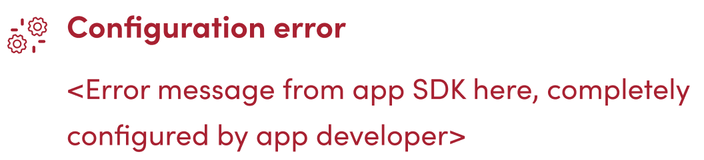
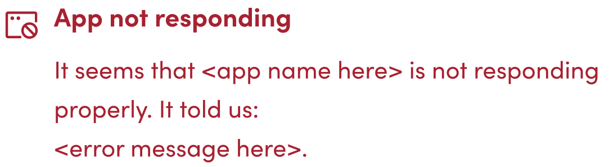
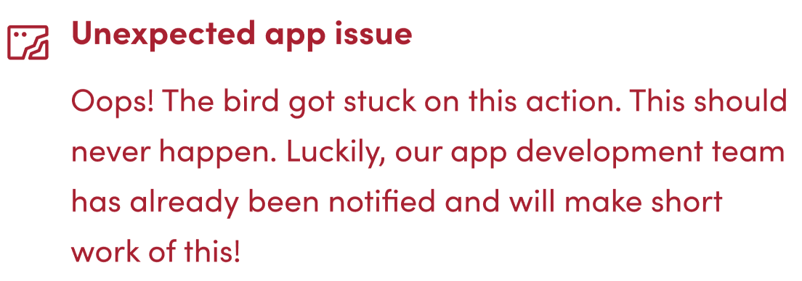

Wanneer je code een fout veroorzaakt, zal deze fout de actie en bird stoppen en deze aan de gebruiker tonen op de flights pagina.

Er zijn 5 verschillende soorten fouten die op de flights pagina kunnen worden weergegeven. 2 soorten fouten worden veroorzaakt door de Blackbird core, de andere 3 kunnen door de app-code worden veroorzaakt. We bespreken hier elk van deze fouten en hoe ze te veroorzaken.

## 1. Configuratiefout



Het doel van deze fout is om de gebruiker te melden dat **zij een fout hebben gemaakt** en **alleen zij het kunnen oplossen**. Dit gebeurt meestal bij verkeerd geconfigureerde variabelen, waarden of omgevingen. Daarom wordt dit fouttype een *configuratiefout* genoemd. Voorbeelden van configuratiefouten zijn:

- Het verzenden van het verkeerde bestandstype.
- Het verzenden van waarden die verkeerd lijken bij het parseren.
- Proberen limieten te overschrijden die door de verbonden app worden opgelegd.
- Wanneer de verbonden app een authenticatie- of autorisatieprobleem aangeeft (401).
- Het creëren van bijv. projecten in een soort illegale configuratie.

Wanneer de configuratiefout wordt veroorzaakt, **moet de beschrijving de gebruiker vertellen hoe het probleem op te lossen**.

De configuratiefout kan worden veroorzaakt door een uitzondering van de klasse `PluginMisconfigurationException` te gooien. Een voorbeeld, genomen uit de memoQ app, wordt hieronder getoond:

```cs
try
{
    var result = projectService.Service.CreateProjectFromTemplate(newProject);
    var response = projectService.Service.GetProject(result.ProjectGuid);

    return new(response);

} catch (System.ServiceModel.FaultException ex)
{
    if (ex.Message == "Message.ResourceNotFound.ProjectTemplate")
        throw new PluginMisconfigurationException("The selected project template does not exist. Please select a different template.");
    else if (ex.Message == "An online project with the same name already exists.")
        throw new PluginMisconfigurationException("An online project with the same name already exists. Please configure a unique name.");
    throw;
}
```

> **Opmerking**: Deze fout wordt ook meestal veroorzaakt wanneer je controleert of de invoerparameters correct zijn.

## 2. App reageert niet



Het doel van deze fout is om de gebruiker te melden dat **de verbonden app problemen heeft waar noch jij** (de app-ontwikkelaar), **noch de gebruiker iets aan kan doen**. Dit is meestal het geval wanneer de app een onverwacht probleem geeft (500), of wanneer de API een fout geeft die bedoeld is voor de gebruiker, in plaats van voor de app-ontwikkelaar. Voorbeelden zijn:

- Wanneer de foutcode van een API-verzoek 500 is (zoals eerder vermeld).
- Wanneer de verbonden app niet bereikbaar is.
- Wanneer een bepaalde limietgrens is bereikt (die niet kan worden opgelost met wacht- en herhalingslogica in de app).

De 'app reageert niet'-fout kan worden veroorzaakt met de klasse `PluginApplicationException`.

> **Opmerking**: Deze fout kan meestal worden afgehandeld in een basis-restclientklasse die de meeste API-aanroepen afhandelt.

## 3. Onverwacht app-probleem



Alle andere fouten die door je app worden veroorzaakt, verschijnen als *onverwachte fouten*. Het doel is om **het aantal onverwachte fouten te minimaliseren**. Als een onverwachte fout wordt gezien, is het de verantwoordelijkheid van de app-ontwikkelaar om de fout in code af te handelen of een van de andere 2 fouttypes te veroorzaken.

Kortom:

- Als noch de gebruiker noch de app-ontwikkelaar iets kan doen -> `PluginApplicationException`.
- Als de gebruiker iets moet doen -> `PluginMisconfigurationException`.
- Als de app-ontwikkelaar iets moet doen -> elke andere uitzondering.

Nog enkele richtlijnen:

- Vang standaard HTTP-fouten op. Bijv. 401 Unauthorized moet de gebruiker informeren dat hun inloggegevens mogelijk verkeerd zijn.
- Als de endpoints verdere informatie geven in hun bodies (misschien in wat json), dan moet deze informatie aan de gebruiker worden doorgegeven, in plaats van een eenvoudige "400 bad request".
- Runtime fouten moeten tegen elke prijs worden vermeden. Controleer op null-referenties, lege arrays, enz. Er mogen geen waarschuwingen in je IDE zijn.
- Vergeet niet te controleren of je JSON-parsing correct werkt, en informeer de gebruiker als er een probleem is.
- Controleer vooraf of de invoerparameter die de gebruiker gebruikt correct is. Als dat niet zo is, informeer de gebruiker hoe deze te corrigeren.