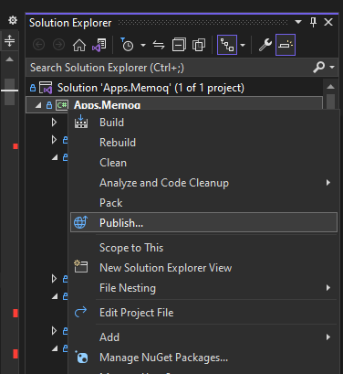

Blackbird apps that you create using the SDK can be deployed to your Blackbird organization as a _custom app_. This tutorial assumes Visual Studio 2022.

Before deploying an app, make sure that it at least contains a class that implements `IApplication` and a class that implements `IConnectionDefinition`.

1. Right-click on your project in the solution explorer and click _Publish_

2. If you have not created a publish profile yet, create a publish profile that publishes to a local folder.
3. Click _Publish_ and then _Open folder_
4. Create a `.zip` archive including **all** files in this folder
5. Go to Blackbird in your browser. On the app you want to update click _New version_ and then _Update App_
6. Upload the `.zip` file to the screen that pops up and click _Update_.

**Note: If you are working on a Mac, make sure to delete the hidden _\_MACOSX_ folder in the zip archive before uploading it to Blackbird.**
