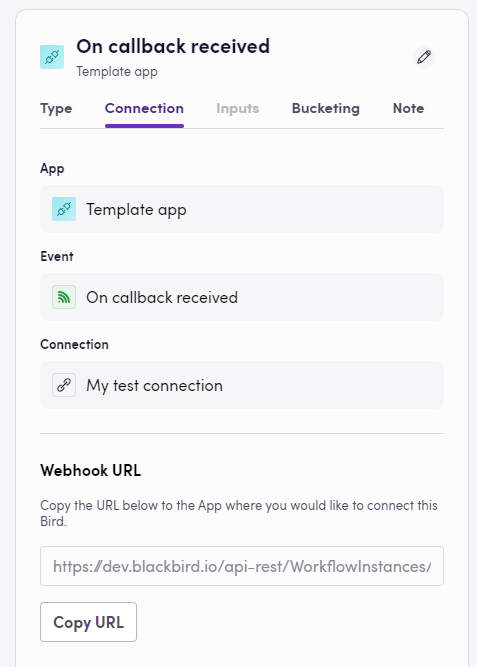

Triggers are an important part of any workflow orchestrator. Blackbird allows custom events to be defined as triggers. These events usually correspond to webhooks in applications but they can also be callback URLs.

## Webhooks

Just like with actions, we use the `WebhookList` attribute to point Blackbirds towards our webhooks. You can split your webhooks into multiple files by providing multiple classes implementing the `WebhookList`. The `Webhook` attribute has to be added to each webhook handling method. Similarly to actions, they also take a name and description.

```cs
[WebhookList]
public class WebhookList
{
  // WebhookList can optionally also inherit from BaseInvocable

  // Just like with articles, we can define the display name and the description.
  [Webhook("On article published", typeof(ArticlePublishedHandler), Description = "On article published")]
  public async Task<WebhookResponse<ArticlePublishedResponse>> ArticlePublishedHandler(WebhookRequest webhookRequest,
    [WebhookParameter][Display("New status")][DataSource(typeof(ItemStatusDataHandler))] string? newStatus) // We can give an (optional, dynamic) parameter to webhooks as well
  {
    // Webhook handling methods usually start with deserializing the WebhookRequest
    var data = JsonConvert.DeserializeObject<ArticlePayloadTemplate<PublishEvent>>(webhookRequest.Body.ToString());
    if (data is null) { throw new InvalidCastException(nameof(webhookRequest.Body)); }

    // Return an instance of WebhookResponse
    return new WebhookResponse<ArticlePublishedResponse>
    {
      HttpResponseMessage = null,
      ReceivedWebhookRequestType = WebhookRequestType.Default,
      Result = new ArticlePublishedResponse
      {
        // Implement
      }
    };
  }
}
```

Some external systems can request additional data, for example, credentials, URL to send the event payload, etc., before sending the event payload. Therefore, we allow you to control the response to the system and if a flight needs to be started with specific credentials.

The Blackbird platform transfers all request parameters to the `WebhookRequest` object. This includes the HTTP method, additional headers, etc. You can use this to decide how to handle this request.

In the `WebhookResponse` class that you return, you can signal to Blackbird if this incoming request should trigger a bird or not. If you don't want to trigger a bird set `ReceivedWebhookRequestType` to `WebhookRequestType.Preflight`.

You can also control what message will be send back to the calling service by providing a `HttpResponseMessage`. If `null` is provided then Blackbird sends a `204 no content` response by default.

All the properties passed to the `Result` class implementation will be available in the bird editor. All `Display` attributes are possible here as well.

You can use the `[WebhookParameter]` attribute to add (optional) input values to your webhook event. F.e. if you want to allow your user to specify their event more narrowly.

### Automatic subscription and unsubscription

To define automatic subscription and unsubscription to webhooks you can implement an instance of `IWebhookEventHandler` and attach it to the webhook as the second argument (see the example above `typeof(ArticlePublishedHandler)`).

The webhook event handler has two methods: `SubscribeAsync` and `UnsubscribeAsync`. There are triggered when a bird is published and unpublished/deleted respectively. Both should implement the API calls that create/delete the webhooks.

An example implementation from the Zendesk app is shown below:

```cs
public class BaseWebhookHandler : BaseInvocable, IWebhookEventHandler
{
  private IEnumerable<AuthenticationCredentialsProvider> Creds => InvocationContext.AuthenticationCredentialsProviders;

  private string SubscriptionEvent;
  private ZendeskClient Client { get; }

  public BaseWebhookHandler(InvocationContext invocationContext, string subEvent) : base(invocationContext)
  {
    SubscriptionEvent = subEvent;
    Client = new ZendeskClient(invocationContext);
  }

  public async Task SubscribeAsync(IEnumerable<AuthenticationCredentialsProvider> authenticationCredentialsProvider, Dictionary<string, string> values)
  {
    var request = new ZendeskRequest($"/api/v2/webhooks", Method.Post, Creds);
    request.AddNewtonJson(new
    {
      webhook = new
      {
        name = SubscriptionEvent,
        description = "",
        // The values["payloadUrl"] contains the URL that the other application can call when the event occurs
        endpoint = values["payloadUrl"],
        status = "active",
        http_method = "POST",
        request_format = "json",
        subscriptions = new[]
        {
            SubscriptionEvent
        }
      }
    });
    await Client.ExecuteAsync(request);
  }

  public async Task UnsubscribeAsync(IEnumerable<AuthenticationCredentialsProvider> authenticationCredentialsProvider, Dictionary<string, string> values)
  {
    // For Zendesk, first we have to fetch the ID of the webhook we created
    var getRequest = new ZendeskRequest($"/api/v2/webhooks?filter[name_contains]={SubscriptionEvent}", Method.Get, Creds);
    var webhooks = await Client.GetAsync<WebhooksListResponse>(getRequest);
    var webhookId = webhooks.Webhooks.First().Id;

    // Then we delete the webhook
    var deleteRequest = new ZendeskRequest($"/api/v2/webhooks/{webhookId}", Method.Delete, Creds);
    await Client.ExecuteAsync(deleteRequest);
  }
}
```

> Tip: you can use the Bird ID from the invocation context to generate unique keys for each subscription if required.

## Callbacks

Blackbird can also handle applications that work with callbacks instead of webhooks. Typically these URLs have to be manually configured. Implementation of this is quite simple and it works exactly the same as webhooks. The only difference is that if you don't define a `IWebhookEventHandler` in the webhook attribute, Blackbird will consider it a callback. In this case Blackbird will provide the user with a URL in the UI when they publish their bird.

The following method has no webhook handler (compare this to the webhooks defined above!)

```cs
[Webhook("On callback received", Description = "On callback received")]
public Task<WebhookResponse<CallbackPayload>> OnCallbackReceived(WebhookRequest webhookRequest)
    => HandlerWebhook<CallbackPayload>(webhookRequest);
```

This translates to:



> Tip: one can use the callback functionality to create "callable" birds as if Blackbird had its own API.

> **💡 Note**: If you create different birds with the same event and the same connection, then all of these birds will have the same URL. Blackbird has the assumption that it is still the same event that is being triggered and this allows us to optimize internally.

> **💡 Note**: If you suspend a bird, or if you change the event and republish the bird, the URL will change and would have to be reconfigured where the URL is applied.
