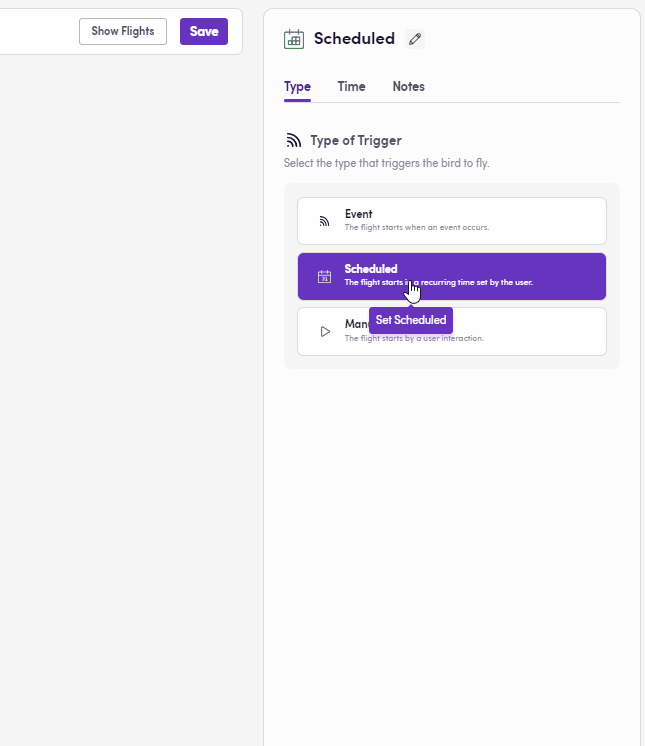
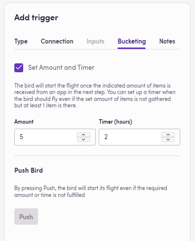
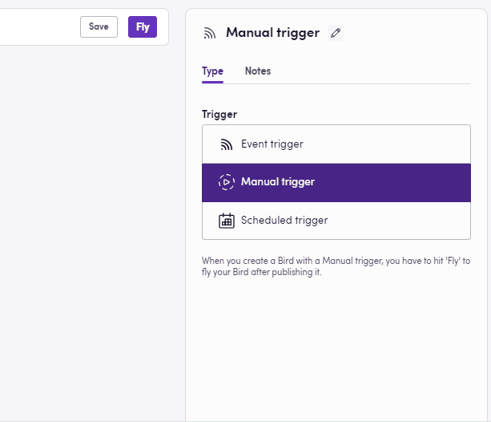

Усі процеси повинні з чогось починатися: **тригер** визначає, коли має запуститися робочий процес, забезпечуючи виконання завдань у потрібний час і за відповідних умов. У Blackbird існує чотири типи тригерів: ручні, заплановані, на основі подій та опитування. Кожен тип виконує свою унікальну функцію і підходить для різних сценаріїв.

## Ручні тригери

Ручні тригери (також називаються [Manual push](https://docs.blackbird.io/guides/manual-triggers/)) активуються через втручання людини. Ці робочі потоки запускаються, щойно хтось натисне кнопку `Fly`. Цей тип тригера ідеально підходить для тестування та відлагодження, або коли процеси потрібно запускати на основі конкретних, часто непередбачуваних умов, які вимагають людського судження. Це рекомендований тип тригера під час створення ваших Birds.

**Ключові особливості**:

**Ініціювання людиною**: Вимагає, щоб особа запустила процес.
**Гнучкість**: Дозволяє використовувати розсуд і оцінку при запуску процесів.
**Випадки використання**: Тестування робочих потоків, ініціювання нерегулярних завдань.

## Заплановані тригери

Заплановані тригери прив'язані до часу і запускають процеси через визначені інтервали. Ці тригери ідеально підходять для завдань, які потрібно виконувати регулярно і послідовно, наприклад, щоденне резервне копіювання даних або щомісячні фінансові звіти. Завдяки автоматизації ініціювання цих завдань, заплановані тригери забезпечують пунктуальне виконання процесів без необхідності ручного втручання.

У Blackbird ви можете вибрати інтервал — з моменту публікації Bird, кожні X годин або хвилин Bird буде запускатися. Інший варіант — запускати процес щодня у певний час або завжди у визначений день тижня/місяця. Крім того, ви можете вказати часовий пояс, щоб уникнути плутанини.

**Ключові особливості**:

**Прив'язка до часу**: Ініціює процеси у визначений час або через певні інтервали.
**Послідовність**: Забезпечує регулярне та своєчасне виконання завдань без втручання людини.
**Випадки використання**: Періодична звітність, рутинна обробка даних, вилучення вмісту з моєї CMS щопонеділка у встановлений час для надсилання на переклад.

## Тригери подій

Тригери на основі подій реагують на конкретні зміни в додатку за допомогою веб-хуків або зворотних викликів. Ці тригери надзвичайно динамічні і активуються визначеними умовами, такими як надходження нового електронного листа, завершення завдання або зміни даних. Тригери на основі подій є необхідними для обробки в реальному часі та адаптивних робочих потоків, де ініціювання процесів повинно бути негайним і залежати від конкретних подій.

Після вибору типу події перейдіть на вкладку Connection або натисніть Continue, виберіть додаток, на який ви хочете реагувати, та тип події (наприклад, завершення завдання в моїй TMS, новий лист в Outlook, створення нового замовлення в Plunet). Після публікації Bird, коли вибрана дія відбудеться, ваш робочий процес зреагує на дію і почне виконуватися.

На зображенні нижче ми можемо вибрати реакцію на різні події, що відбуваються в Zendesk, наприклад, публікацію нової статті.

Якщо потрібні додаткові налаштування (деякі додатки цього вимагають), ви можете побачити URL, який потрібно скопіювати та вставити кудись. У таких сценаріях деталі будуть вказані у розділі додатку в документації Blackbird.

**Ключові особливості**:

**На основі подій**: Активується конкретними системними подіями або змінами.
**Швидка реакція**: Забезпечує реакцію на події в реальному часі.
**Випадки використання**: Оновлення даних у реальному часі, автоматичні сповіщення, умовне виконання завдань.

## Групування

Іноді реагування кожного разу, коли щось відбувається, може створювати безлад, оскільки ці дії відбуваються занадто часто. Тут на допомогу приходить Групування. Ви можете налаштувати свій Bird так, щоб Blackbird збирав ці події і запускався тільки після того, як відбудеться X кількість дій або мине певний час. Додайте свої налаштування до вкладки Bucketing для цього.

На зображенні нижче, продовжуючи попередній приклад, ми не хочемо створювати новий проект TMS кожного разу, коли стаття публікується в Zendesk. Замість цього ми чекаємо, поки буде опубліковано принаймні п'ять статей або пройде дві години, залежно від того, що станеться раніше. Якщо через дві години було опубліковано лише три статті, Bird все одно виконається і створить новий проект TMS для цих трьох статей. Таке налаштування забезпечує достатню швидкість реагування процесів без створення надмірного шуму.

## Опитування

Оскільки деякі системи не мають веб-хуків або зворотних викликів, але ми все ще хочемо бути старанними та реактивними, Blackbird запустив події опитування. Для звичайного користувача цей тригер виглядає точно так само, як і тригер на основі подій, тоді як, під капотом, Blackbird перевіряє зміни у визначені інтервали. Цей тип запланованого тригера шукає оновлення в даних додатка, щоб вирішити, чи запускати робочий процес, заповнюючи прогалину для додатків, які не надають веб-хуки, дозволяючи нашим Birds реагувати в _реальному часі_.

## Контрольні точки

Ця інноваційна функція дозволяє використовувати тригери всередині Bird, даючи можливість вашому Bird чекати настання певної події перед переходом до наступних кроків. Знайдіть більше інформації про Контрольні точки у спеціальній статті [тут](https://docs.blackbird.io/concepts/checkpoints/).