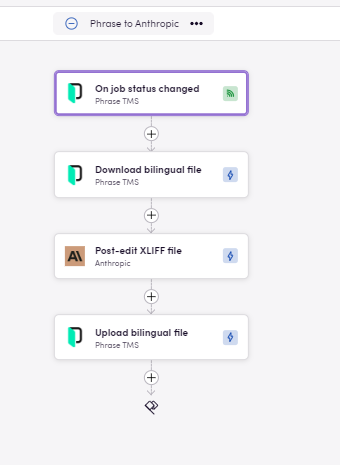
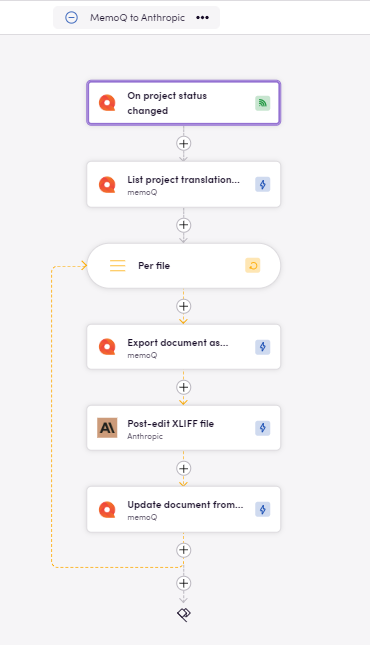
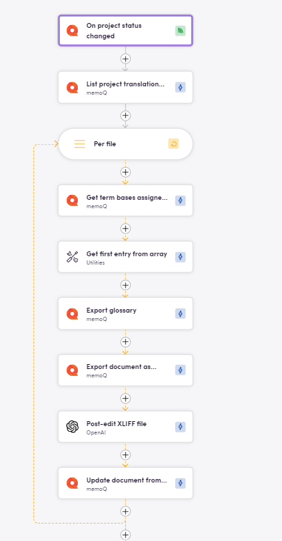

### Eggs: Відправні точки для ваших Birds

У Blackbird.io, Eggs (Яйця) — це зародки або креслення для ваших робочих процесів. Вони представляють початкові ідеї, які мають потенціал перетворитися на повноцінні Birds (Птахи).

У цьому посібнику з Egg розглянемо деякі варіанти інтеграції TMS та LLM. [Знайдіть **Яйця для завантаження** наприкінці!](https://docs.blackbird.io/eggs/tms-to-llm/#download-an-egg)

## Опис процесу

1. **Тригер: статус у вашій TMS**
Файли, завдання або проєкти досягають певного статусу у вашому робочому процесі TMS
2. **Завантаження файлу**
Файли завантажуються з TMS.
3. **LLM**
Завантажені файли надсилаються до LLM для обробки.
4. **Завантаження оброблених файлів**
Оброблені файли завантажуються назад до TMS.

Яйце між Phrase та Anthropic

## Поради

- **Промпт:** У необов'язкових входах ви можете додати власні інструкції для LLM.
- **Розмір групи:** XLIFF файли можуть містити багато сегментів. Кожна дія бере ваші сегменти та надсилає їх до LLM для обробки. Можливо, що кількість сегментів настільки велика, що промпт перевищує контекстне вікно моделі або модель займає більше часу, ніж дозволено діям Blackbird. Саме тому ми представили параметр розміру групи. Ви можете налаштувати цей параметр, щоб визначити, скільки сегментів надсилати до LLM одночасно. Це дозволить вам розділити навантаження на різні виклики. Компроміс полягає в тому, що однаковий контекстний промпт потрібно надсилати з кожним запитом (що збільшує використання токенів). З експериментів ми виявили, що розмір групи 1500 достатній для таких моделей, як gpt-4o. Тому 1500 є розміром групи за замовчуванням, однак інші моделі можуть потребувати інших розмірів групи.
- **Події опитування:** Деякі програми використовують [опитування](https://docs.blackbird.io/concepts/triggers/#polling) замість вебхуків для виявлення оновлених/нових файлів. Перевірте наявність вкладки _Інтервал_ під час налаштування тригера та виберіть відповідний для вас час (від 5 хвилин до 7 днів).
- **Інтеграція глосарію:** Глосарії можна додавати для підвищення точності та узгодженості перекладу. Їх можна експортувати з низки програм, і Blackbird забезпечить сумісність (програми включають TMS і CAT інструменти, навіть [таблиці Microsoft Excel](https://docs.blackbird.io/apps/microsoft-excel/#exporting-glossaries)).
- **Цільова мова:** Ви можете вибрати мову з вхідних даних програми LLM, яку використовуєте. Якщо вони не надані, мови будуть взяті з заголовка ваших XLIFF файлів.
- **Необов'язкові параметри:** Багато LLM програм пропонують різні параметри для налаштування, такі як формальність, температура, моделі та розмір групи. Перевірте вкладку вхідних даних для всіх кроків.
- **Потрібні цикли:** Незалежно від того, ітеруєте ви через список цільових мов чи надсилаєте кожен файл з групи завантажених файлів до дії, що приймає лише один за раз, [цикли](https://docs.blackbird.io/guides/loops/) є ключовим елементом.

Яйце між MemoQ та Anthropic

Яйце між MemoQ та OpenAI з глосаріями.

## Рекомендовані програми

### LLMs

- [OpenAI](https://docs.blackbird.io/apps/openai/)
- [Anthropic](https://docs.blackbird.io/apps/anthropic/)
- [Google Vertex AI](https://docs.blackbird.io/apps/google-vertex-ai/)

## Завантажити Egg

Завантажте JSON робочі процеси для імпорту у ваше Nest, внесіть будь-які бажані коригування та **злітайте**.

- <a href="https://docs.blackbird.io/downloads/MemoQ_to_OpenAI.json" download>MemoQ to OpenAI</a>
- <a href="https://docs.blackbird.io/downloads/MemoQ_to_OpenAI_with_Glossary.json" download>MemoQ to OpenAI з глосаріями</a>
- <a href="https://docs.blackbird.io/downloads/MemoQ_to_Anthropic.json" download>MemoQ to Anthropic</a>
- <a href="https://docs.blackbird.io/downloads/Phrase_to_Anthropic.json" download>Phrase to Anthropic</a>

### Імпорт Eggs

Щоб імпортувати Egg у ваше Nest:

1. Перейдіть до розділу редактора Bird.
2. Натисніть на Import у правому верхньому куті.
3. Виберіть файл Egg (JSON) для імпорту та натисніть `Import`.
4. Знайдіть новостворений Bird і натисніть на нього для редагування.
5. Додайте деталі з'єднання та будь-які інші необхідні параметри вводу/виводу або бажані кроки. Шукайте червоні попереджувальні знаки поруч з назвою кроку, що сигналізують про відсутні деталі в цьому кроці.
6. Натисніть на три крапки поруч з назвою Bird і оновіть програми, якщо є доступні оновлення.
7. Натисніть Зберегти/Опублікувати.

