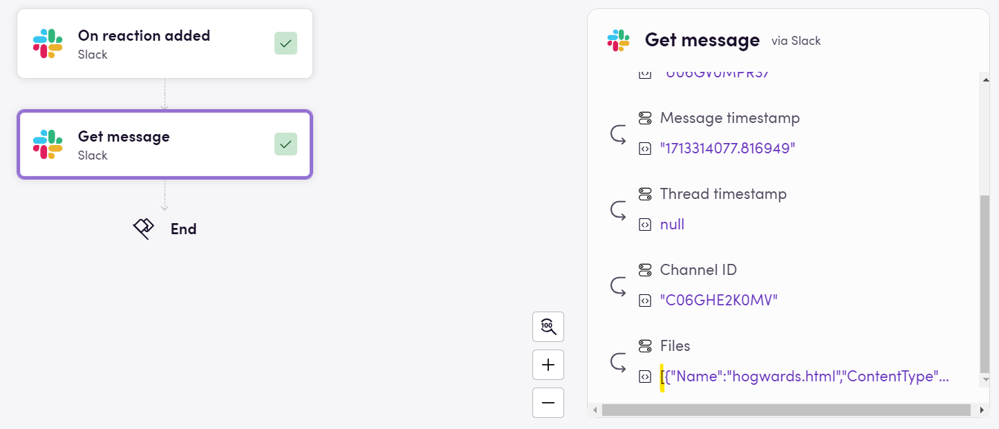
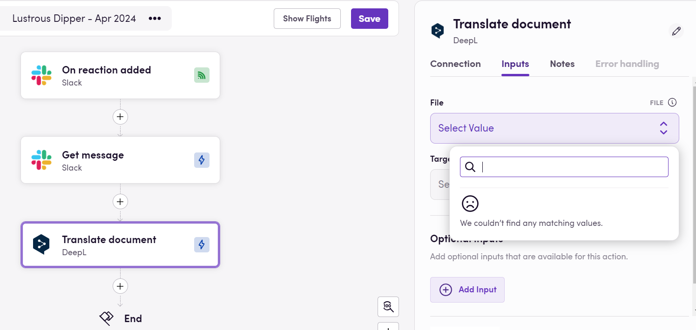
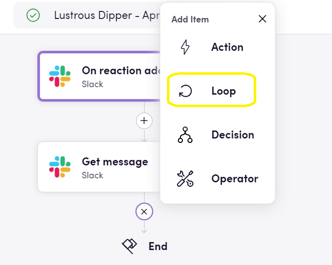
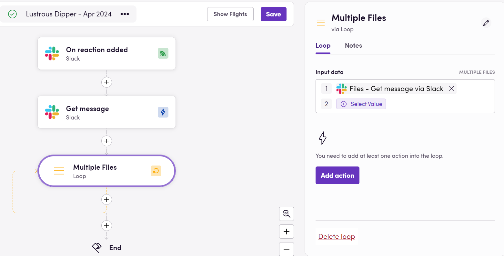
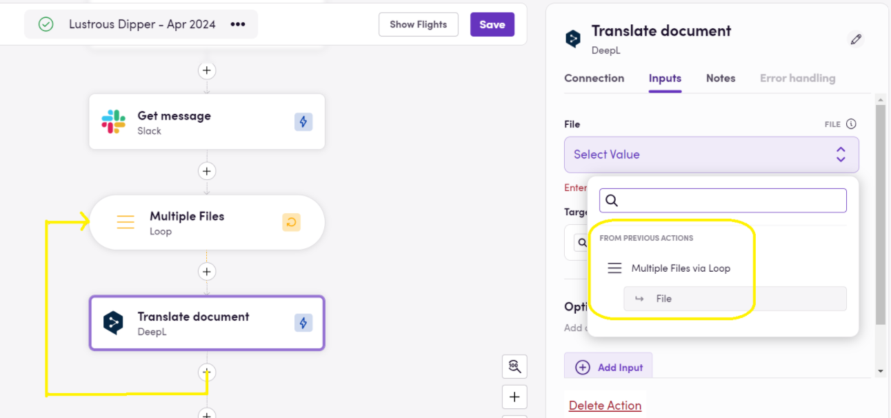
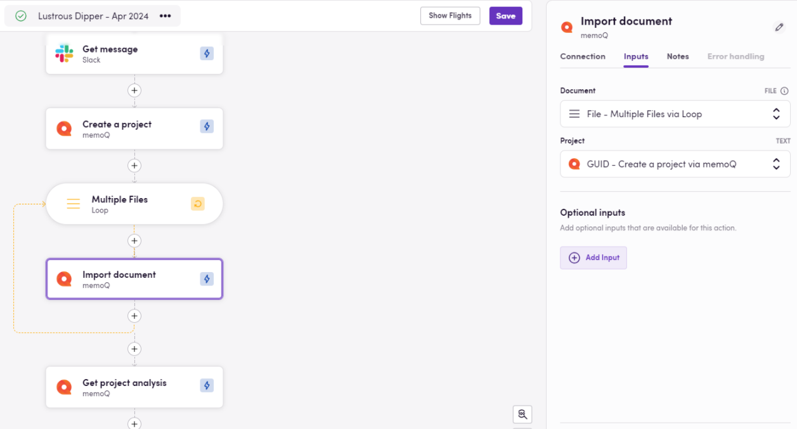

Ласкаво просимо до Циклів 101 - вашого посібника з освоєння циклів Blackbird.io без заплутування в технічних термінах!

## Розуміння основ
У Blackbird.io дії в робочому процесі іноді можуть створювати вихідні дані, що приходять у групах, як набори елементів. Ці групи відомі як масиви або списки. Але коли наступна дія очікує лише один елемент, а не цілу групу, саме тут вступає в гру цикл.

Візьмемо цю дію "Get message" зі Slack. Оскільки повідомлення може містити кілька вкладень, Blackbird.io повертає "групу" вкладень (навіть якщо в конкретному повідомленні є лише одне вкладення). Перевіряючи вкладку Flights, ми можемо побачити квадратні дужки "[]" навколо "списку" вкладень. Це ключовий момент для ідентифікації масивів.

## Що робить цикл?
Уявіть цикл як корисного помічника, який бере кожен елемент у групі, по одному, і проводить його через наступну дію. Це схоже на перевірку списку пункт за пунктом, переконуючись, що все виконується.

Скажімо, повертаючись до нашого прикладу, що ми хочемо перекласти ці прикріплені файли через DeepL. Тож ми шукаємо дію DeepL "Translate Document". Ми бачимо, що ця дія очікує файл як один із вхідних даних. Однак, коли ми намагаємося використати _Magic Wand_ для перегляду вихідних даних наших попередніх дій, ми не бачимо наших прикріплених файлів у списку. Це тому, що нова дія очікує на один файл, а не на багато, не на групу. Час додати цикл.

## Як додати цикл?
Так само, як додається нова дія, натискаючи знак плюс. Але замість вибору Actions, Operators або Decisions, ми вибираємо `Loop`. Після цього потрібно вибрати "групу елементів", яку ми хочемо перебрати.

## Які дії розміщувати всередині?
Дії, які повинні відбуватися повторно або для кожного елемента в моїй групі/масиві, розміщуються всередині циклу знову ж таки за допомогою знаку плюс та вибору зазначеної дії(й). Зверніть увагу на лінії потоку, що повертаються до початкової точки циклу, ніби повторюючи самі себе (поки ми не вичерпаємо елементи в групі).
 

## Збереження дій поза циклом
А як щодо дій, які не потрібно виконувати для кожного окремого елемента? Вони можуть залишатися поза циклом. Це завдання, які потрібно виконати лише один раз, незалежно від кількості елементів у групі.

Скажімо, ми хочемо розмістити наші прикріплені файли в проекті memoQ і використовувати їх як вихідні файли. Якби ми хотіли створити один проект на кожен прикріплений файл, все, що нам потрібно було б зробити, це розмістити дію "Create Project" всередині циклу, що проходить через кожен файл. Проте насправді ми хочемо, щоб один проект містив усі наші файли. Тому дія "Create project" повинна відбуватися поза моїм циклом, і включати лише "Import Document" всередині циклу, приймаючи як вхідні дані кожен окремий файл і перебираючи їх, поки всі не будуть імпортовані; потім потік продовжуватиметься з одиночними діями, можливо, отримуючи інформацію з мого новоствореного проекту _загалом та один раз_.

> Для зручності використання ми пропонуємо перейменувати ваш цикл на щось, що зробить абсолютно зрозумілим для вас, через які елементи ви проходите. Для цього використовуйте значок олівця поруч із заголовком вашої дії в правій панелі, коли зазначена дія вибрана.

## Підсумовуючи все разом
Вітаємо, мої пернаті друзі! Ви успішно завершили короткий курс з циклів у Blackbird.io. Тепер, коли ви опанували мистецтво циклів, давайте розправимо крила та застосуємо це на практиці!