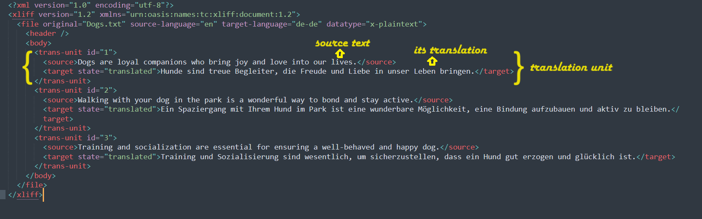
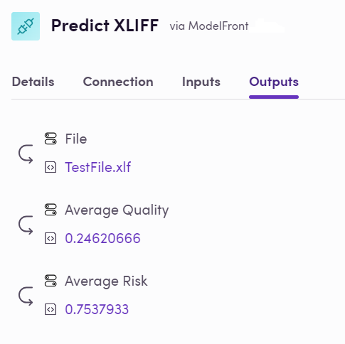
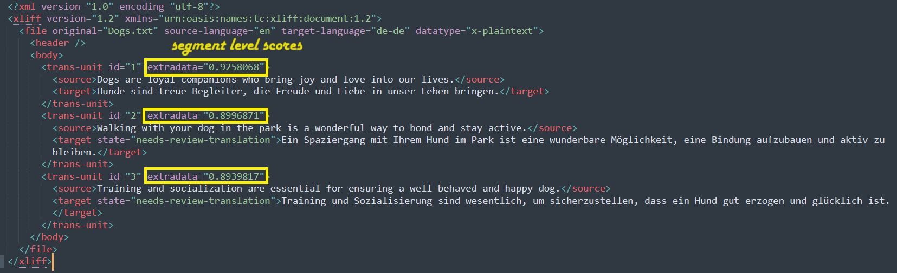
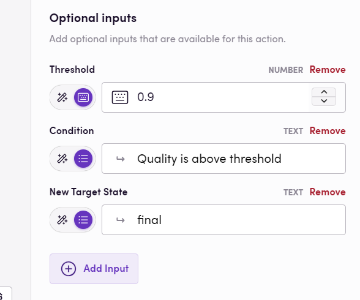
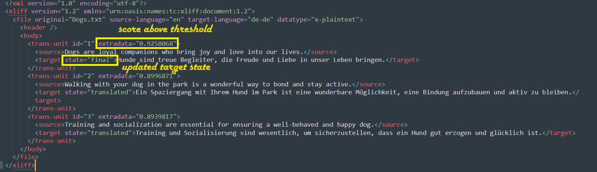
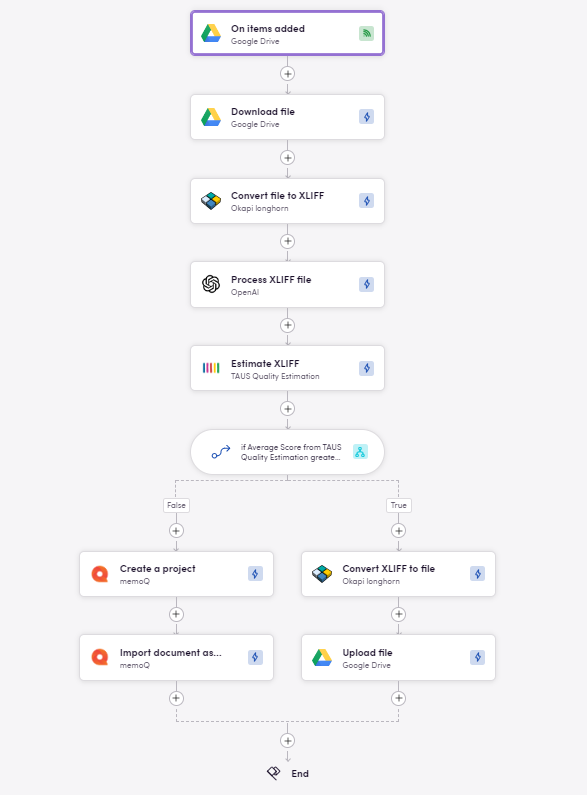

XLIFF (XML Localization Interchange File Format) є маяком стандартизації в галузі мови та локалізації, що дозволяє безперешкодно обмінюватися даними перекладу. Він організовує вміст у одиниці перекладу, кожна з яких складається з вихідного сегмента та відповідного цільового перекладу.

Хоча більшість систем управління перекладом (TMS) та інструментів комп'ютерного перекладу (CAT) легко обробляють файли XLIFF, деякі інші інструменти можуть бути не такими дружніми до файлів. Однак у середовищі Blackbird.io, де царює взаємодія, ми розгорнули нові крила — точніше, дії — щоб змусити XLIFF літати навіть у додатках, не орієнтованих на роботу з файлами.

### Що нового?

У нашому останньому випуску ми представили нові дії, які дозволяють файлам XLIFF витончено "танцювати" через такі додатки, як OpenAI, DeepL, ModernMT, Anthropic, TAUS і ModelFront, які зазвичай віддають перевагу тексту, а не файлам.

### Чому саме XLIFF?

А чому б і ні? Це універсальна мова локалізації! Крім того, з нашими нещодавно інтегрованими додатками, фільтрами Okapi та Matecat, конвертація між різними форматами файлів та XLIFF ще ніколи не була такою плавною. Це означає, що ваша зграя додатків тепер може об'єднатися в гармонійний політ, розширюючи горизонти того, що можливо з Blackbird.io.

## Додатки для конвертації файлів

### Okapi

З платформою [Okapi](https://docs.blackbird.io/apps/okapi/) на борту конвертація файлів у XLIFF та з нього — це просто. Наші дві нові дії, "Convert file to XLIFF" та її надійний аналог "Convert XLIFF to file", прокладають шлях для безперешкодних перетворень форматів файлів. Перегляньте підтримувані типи файлів для цих дій [тут](https://www.okapiframework.org/wiki/index.php?title=Filters) і дозвольте вашим файлам розправити крила.

### Matecat filters

Ще один потужний додаток для конвертації в XLIFF і назад — це [Matecat filters](https://docs.blackbird.io/apps/matecatfilters/), оскільки він дозволяє витягнути весь вміст, що підлягає перекладу, з будь-якого підтримуваного формату файлів у зручний файл XLIFF. Після перекладу XLIFF ви можете знову використовувати фільтри, щоб отримати ваш файл цільовою мовою з ідеально збереженим форматуванням.

## LLMs

### OpenAI

Представляємо наші передові дії для обробки файлів XLIFF! Blackbird.io пропонує три зручні дії для використання потужності ШІ для вдосконалення вашого робочого процесу перекладу:

- Process XLIFF File: Ця дія приймає файл XLIFF як вхідні дані, ретельно аналізуючи всі вихідні сегменти. Ви можете надати конкретні інструкції через вхідні дані `Prompt` або дозволити [OpenAI](https://docs.blackbird.io/apps/openai/) перекладати за замовчуванням. Результати плавно вставляються в цільові сегменти, забезпечуючи повністю локалізований файл XLIFF як вихідні дані. Підтримка глосарію доступна для збереження узгодженості термінології.
- Post-edit XLIFF: Ця дія йде на крок далі, обробляючи як вихідні, так і цільові сегменти. Вона вдосконалює існуючі переклади, вносячи необхідні правки для покращення загальної якості. З можливістю включення глосаріїв вона гарантує, що ваші переклади не тільки точні, але й узгоджені з вашою бажаною термінологією.
- Get Quality Scores for XLIFF file: Ця дія оцінює якість ваших перекладів, призначаючи оцінку кожній одиниці перекладу та загальну оцінку на рівні файлу. Знайдіть більше інформації про цю дію [тут](https://docs.blackbird.io/apps/openai/#xliff-operations).

### Anthropic

Подібні дії були додані до [Anthropic](https://docs.blackbird.io/apps/anthropic/#xliff-actions), щоб ви могли експериментувати з моделлю на ваш вибір.
Дії:

- Process XLIFF
- Post-edit XLIFF file
- Get Quality Scores for XLIFF file

## Машинний переклад

### DeepL

Хоча [DeepL](https://docs.blackbird.io/apps/deepl/) підтримує кілька [типів файлів](https://developers.deepl.com/docs/api-reference/document), лише версія 2.1 є допустимим вхідним форматом, коли мова йде про файли XLIFF. Ми додали більше магії за лаштунками, щоб подолати цей розрив, щоб ви могли перекладати через DeepL ваші файли XLIFF 1.2, а також будь-які інші файли, раніше конвертовані в XLIFF 1.2 за допомогою наших дій фільтрів Okapi або Matecat.

### ModernMT

Наш додаток [ModernMT](https://docs.blackbird.io/apps/modernmt/) також був адаптований так, щоб файли XLIFF могли бути оброблені або для перекладу цілих файлів, або для отримання оцінки якості. Файли, що надходять із фільтрів Okapi або Matecat, обробляються бездоганно.

## Додатки для оцінки якості ([TAUS](https://docs.blackbird.io/apps/taus/), ModernMT, OpenAI, Anthropic & [ModelFront](https://docs.blackbird.io/apps/modelfront/))

Наші найновіші дії Blackbird.io дозволяють переглядати якість вашого XLIFF з висоти пташиного польоту. Обчислюючи оцінку якості кожного сегмента в XLIFF і повертаючи узагальнене число, яке дає нам уявлення про загальну якість у файлі. Раніше це було зарезервовано тільки для окремих сегментів. Крім того, всі одиниці перекладу доповнюються їхньою індивідуальною оцінкою, яка додається до атрибуту extradata у файлі XLIFF.

Опціонально, параметри вхідних даних Threshold, New Target State та Condition можуть бути встановлені для дії Blackbird.io, щоб змінити значення цільового стану сегментів, які відповідають бажаним критеріям. Це означає, що ви можете правильно позначити перекладені сегменти та заблокувати їх при імпорті файлу XLIFF у TMS для людського перегляду, заощаджуючи час і гроші та зосереджуючи зусилля на тих сегментах, які дійсно потребують редагування.

Приклад

Встановлення опціональних вхідних значень, як показано на зображенні нижче, призведе до того, що всі сегменти з оцінкою вище 0.9 матимуть оновлені значення цільового стану до "final". При імпорті цих файлів XLIFF у інструменти TMS, зазвичай можна додати налаштування для блокування сегментів з певним цільовим значенням (у цьому випадку "final"), щоб перекладачі могли зосередитися та редагувати лише сегменти нижчої якості.

## Погляньте на величного птаха в дії!

Хоча нові дії самі по собі додають велику цінність і відкривають нові можливості, при поєднанні вони стають ще потужнішими. Нижче наведено приклад птаха, який приймає файл .docx як вхідні дані, файл потім конвертується в XLIFF для цілей взаємодії, OpenAI потім використовується для перекладу файлу цільовою мовою. Після цього TAUS використовується для визначення якості зазначених перекладів, а оператор рішення використовується для визначення наступних кроків для файлу: якщо середня оцінка якості вище визначеного порогу 0.95, XLIFF потім конвертується в перекладений .docx і доставляється як остаточний. В іншому випадку, якщо середня оцінка нижче 0.95, файл імпортується в TMS для подальшого редагування людиною. Це гарантує, що лише файли, які дійсно потребують втручання людини, завантажуються в TMS, тоді як якісні переклади негайно доставляються назад.

