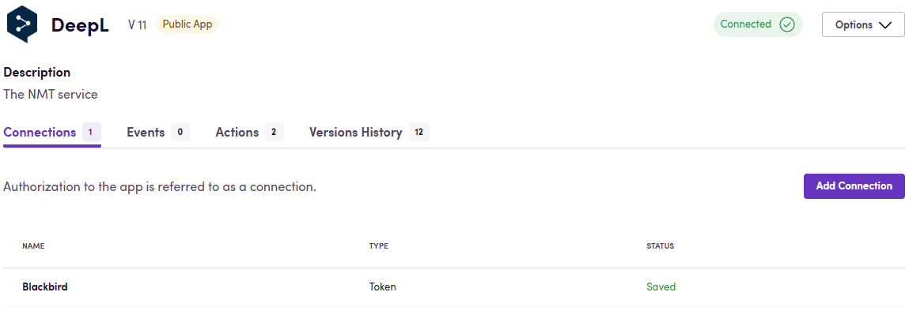

З'єднання - це спосіб підключення додатків. Birds авторизують їхню взаємодію з іншими додатками або сервісами через з'єднання.

## Налаштування

Перш ніж почати, вам потрібно переконатися, що у вас є додаток. Ви можете перейти до вкладки _Apps_ за допомогою верхньої навігації. За бажанням ви можете додати новий додаток, натиснувши кнопку _Add App_ у правому верхньому куті. Виберіть додаток зі списку або додайте новий.

Коли у вашому перегляді є один або кілька додатків, ви можете натиснути на додаток, щоб почати з'єднання. На екрані з'єднань натисніть _Add connection_. Дотримуйтесь інструкцій або прочитайте документацію для конкретного додатка.

