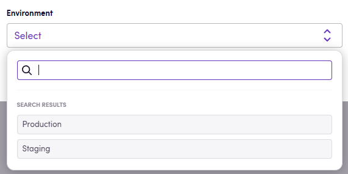
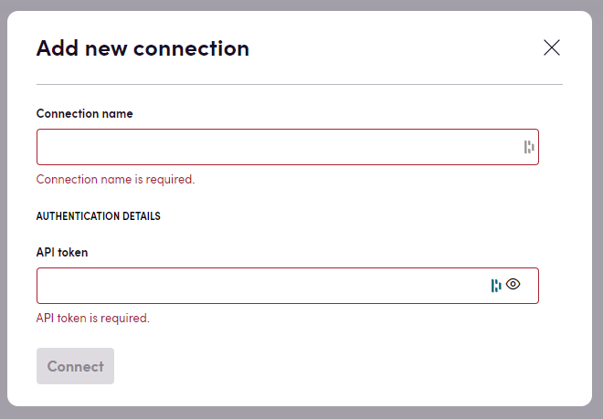

> Усі фрагменти коду на цій сторінці також можна переглянути в [шаблонному додатку](https://github.com/bb-io/TemplateApp).

Коли користувач хоче створити підключення з вашим додатком, йому буде показано запит. У цьому запиті можуть бути надані поля змінного введення, які відповідають значенням, які вам потрібно зберегти для встановлення підключення. Альтернативно, ви можете повідомити Blackbird використовувати OAuth замість цього. У цій статті ми пояснимо, як реалізувати інтерфейс `IConnectionDefinition`, інтерфейс `IConnectionValidator` і як використовувати підключення в решті вашого коду.

> Усі облікові дані надійно зберігаються в сховищі ключів Blackbird, що означає, що всі облікові дані зберігаються як пари ключ/значення.

## Властивості підключення

`IConnectionDefinition` використовується для зберігання визначень усіх різних полів, які можуть бути визначені користувачем в інтерфейсі підключення. Властивість `ConnectionPropertyGroups` повинна реалізувати список `ConnectionPropertyGroups`. Розділення облікових даних на різні групи дозволяє вам вказати різні методи автентифікації для одного додатка, якщо він використовує різні методи автентифікації для дій та вебхуків.

У своїй найпростішій формі одна група має список `ConnectionProperty`. Назви цих властивостей будуть відображатися в інтерфейсі Blackbird під час створення нового підключення. Ви також можете використовувати властивість `DisplayName` для визначення користувацького відображення цього входу. Також ви можете використовувати властивість `Sensitive` для визначення входів для паролів.

```cs
public IEnumerable<ConnectionPropertyGroup> ConnectionPropertyGroups => new List<ConnectionPropertyGroup>
{
    // API token auth example
    new()
    {
        Name = "Developer API token",
        AuthenticationType = ConnectionAuthenticationType.Undefined,

        // Specifying properties that we will need for authorization of the app
        ConnectionProperties = new List<ConnectionProperty>
        {
            new(CredsNames.ApiToken)
            {
                // Property user-friendly name that will be displayed on the UI
                DisplayName = "API token",

                // Setting this flag to true hides token input, replacing each its character with •
                Sensitive = true,
                // Description of the connection property,
                // perhaps with some guidelines on how to find it in the service
                Description = "You can create API token in your profile settings, on the API tab"
            }
        }
    }
};
```

Ваша властивість підключення також може бути випадаючим списком кінцевих значень. Для цього використовуйте властивість `DataItems`:

```cs
    new(CredsNames.Environment)
    {
        DisplayName = "Environment",
        Description = "Whether to use staging or production",
        DataItems = 
        [
            new (Urls.ProductionApi, "Production"),
            new (Urls.StagingApi, "Staging")
        ]
    }
```

Це призведе до відображення випадаючого списку:



## Перетворення властивостей підключення на облікові дані

Пам'ятаєте, що ми зберігаємо всі властивості підключення як пари ключ/значення в захищеному сховищі? Метод `CreateAuthorizationCredentialProviders` перетворює список збережених пар ключ/значення у доступний список облікових даних, переданих у дії та вебхуки. Цей метод дозволяє вам вказати тут більше інформації залежно від вашої реалізації. У своїй найпростішій формі цей метод просто перетворює пари ключ/значення в `AuthenticationCredentialsProvider`.

```cs
public IEnumerable<AuthenticationCredentialsProvider> CreateAuthorizationCredentialsProviders(
    Dictionary<string, string> values)
{
    // Processing API key credentials
    var apiKey = values.First(v => v.Key == CredsNames.ApiToken);
    yield return new AuthenticationCredentialsProvider(
        apiKey.Key,
        apiKey.Value
    );
}
```

Якщо вам не потрібно робити жодних перетворень, тоді ви можете просто реалізувати це скорочення:

```cs
public IEnumerable<AuthenticationCredentialsProvider> CreateAuthorizationCredentialsProviders(
    Dictionary<string, string> values) => values.Select(x => new AuthenticationCredentialsProvider(x.Key, x.Value)).ToList();
```

## OAuth підключення

Щоб вказати, що OAuth2 слід використовувати на екрані підключення, використовуйте `ConnectionAuthenticationType.OAuth2` як тип підключення. У цьому випадку ви все ще можете додати додаткові властивості підключення, якщо вам це потрібно.

Коли використовується OAuth2, метод `CreateAuthorizationCredentialsProviders` також отримає додаткову пару ключ/значення з назвою _access_token_. Це потім можна перетворити в `AuthenticationCredentialsProvider`.

```cs
public class ConnectionDefinition : IConnectionDefinition
{
    public IEnumerable<ConnectionPropertyGroup> ConnectionPropertyGroups => new List<ConnectionPropertyGroup>
    {
        // OAuth example
         new()
         {
             Name = "OAuth2",
             AuthenticationType = ConnectionAuthenticationType.OAuth2,
             ConnectionProperties = new List<ConnectionProperty>()
         },
    };

    public IEnumerable<AuthenticationCredentialsProvider> CreateAuthorizationCredentialsProviders(
        Dictionary<string, string> values)
    {
        // Processing OAuth credentials
        var accessToken = values.First(v => v.Key == CredsNames.AccessToken);
        yield return new AuthenticationCredentialsProvider(
            "Authorization",
            $"Bearer {accessToken.Value}"
        );
    }
}
```

### Визначення потоків OAuth2

Blackbird може підтримувати додатки, які вимагають OAuth2 підключень. На даний момент Blackbird підтримує такі стандартні потоки:

- Код авторизації (Розділ 1.3.1 [RFC](https://www.ietf.org/rfc/rfc6749.txt) )
- Неявний грант (Розділ 1.3.2 [RFC](https://www.ietf.org/rfc/rfc6749.txt) )

Щоб почати, реалізуйте інтерфейси для `IOAuth2AuthorizeService` та `IOAuth2TokenService`.

Потім додайте посилання на ці інтерфейси у вашому `IApplication`.

Коли починається потік OAuth2, Blackbird викликає екземпляри `IOAuth2AuthorizeService` та `IOAuth2TokenService` за допомогою методу `GetInstance<T>` інтерфейсу `IApplication`. Ви повинні реалізувати логіку повернення екземплярів цих інтерфейсів.

Розглянемо простий приклад реалізації:

```cs
public class SampleApplication : IApplication
{
  private readonly Dictionary<Type, object> _container;

  public SampleApplication()
  {
    _container = LoadTypes();
  }

  public T GetInsance<T>()
  {
    return _container[typeof(T)] as T;
  }

  private Dictionary<Type, object> LoadTypes()
  {
    new Dictionary<Type, object>
    {
      new { IOAuth2AuthorizeService, new OAuth2AuthorizeService() },
      new { IOAuth2TokenService, new OAuth2TokenService() }
    }
  }
}
```

`IOAuth2AuthorizeService` генерує URL автентифікації на основі підключення та деяких значень, ін'єктованих Blackbird. Наступний приклад використовує потік неявного гранту.

```cs
public class OAuth2AuthorizeService : BaseInvocable, IOAuth2AuthorizeService
{
    public OAuth2AuthorizeService(InvocationContext invocationContext) : base(invocationContext)
    {
    }

    public string GetAuthorizationUrl(Dictionary<string, string> values)
    {
        var parameters = new Dictionary<string, string>
        {
            { "client_id",  ApplicationConstants.ClientId},
            { "redirect_uri", InvocationContext.UriInfo.ImplicitGrantRedirectUri.ToString()},
            { "scope", ApplicationConstants.Scope },
            { "state", values["state"] }
        };

        // Creating url with query parameters
        return Urls.Authorize.WithQuery(parameters);
    }
}
```

Інтерфейс `IOAuth2TokenService` визначає, як інтерпретувати перенаправлення назад до Blackbird і як зберігати/обробляти надані токени. Токени, які передаються як словник у Blackbird після виклику методу `RequestToken`, зберігаються в сховищі ключ/значення. Пізніше вони можуть бути використані методом `CreateAuthorizationCredentialProviders`. `IOAuth2TokenService` реалізує такі дії:

- `IsRefreshToken` повинен повертати true, якщо поточний токен, збережений у сховищі ключ/значення, потрібно оновити.
- `RequestToken` отримує стан, код та інші значення, передані в URL перенаправлення, коли користувач створює своє OAuth підключення. Використовуйте його для отримання правильного токена. Повернутий словник зберігається в сховищі ключ/значення.
- `RefreshToken` викликається, коли `IsRefreshToken` має значення true.
- `RevokeToken` викликається, коли користувач видаляє своє підключення.

Повний приклад можна знайти [тут](https://github.com/bb-io/TemplateApp/blob/master/TemplateApp/Connections/OAuth/OAuth2TokenService.cs).

## Перевірка підключень

Ми хочемо перевірити, що надані облікові дані є дійсними, і надати безпосередній відгук користувачеві в інтерфейсі Blackbird. Перевірка підключення — це відповідальність інтерфейсу `IConnectionValidator`. Метод `ValidateConnection` повинен повертати об'єкт, який вказує, чи є підключення дійсним, і необов'язково повідомлення про помилку, яке буде відображено.

```cs
public class ConnectionValidator : IConnectionValidator
{
    private static readonly AppRestClient Client = new();

    public async ValueTask<ConnectionValidationResponse> ValidateConnection(
        IEnumerable<AuthenticationCredentialsProvider> authProviders, CancellationToken cancellationToken)
    {
        var request = new AppRestRequest(ApiEndpoints.Berry, Method.Get, authProviders);

        try
        {
            await Client.ExecuteWithHandling<ListResponse<Berry>>(request);

            // If ExecuteWithHandling did not throw an exception
            // then request was successful and credentials are valid
            return new()
            {
                IsValid = true
            };
        }
        catch (Exception ex)
        {
            // If Exception was thrown, we mark connection credentials as invalid
            // and pass the exception message in the response
            return new()
            {
                IsValid = false,
                Message = ex.Message
            };
        }
    }
}
```

Після налаштування всього цього, Blackbird тепер може відображати форму підключення для користувача.



## Доступ до облікових даних у діях та подіях

Як уже зазначалося раніше, у своїх діях та подіях ви маєте доступ до облікових даних, збережених у сховищі ключ/значення. Облікові дані передаються об'єкту `InvocationContext`, який ін'єктується в будь-який клас, що успадковує `BaseInocable`, серед інших контекстних змінних. Використовуйте властивість `InvocationContext.AuthenticationCredentialsProviders` для отримання пар ключ/значення, як вони повертаються з методу `CreateAuthorizationCredentialsProviders` в `ConnectionDefinition`.