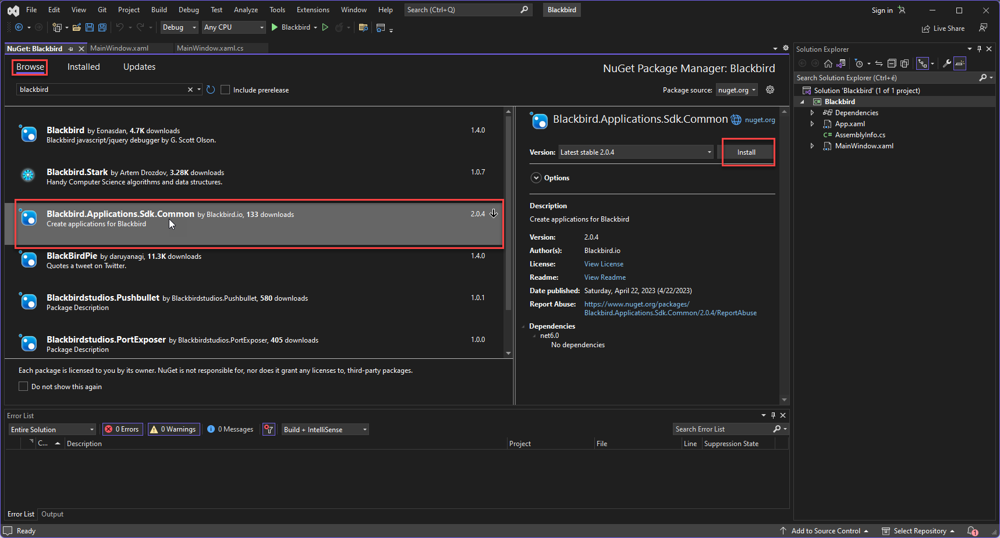
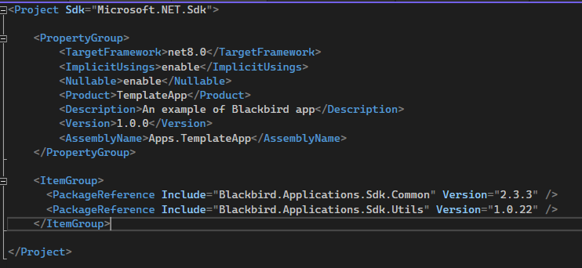

Використовуйте ваше улюблене IDE для створення бібліотеки класів .NET, щоб розпочати ваш проєкт. Потім встановіть наш SDK за допомогою NuGet. Ви можете знайти посилання на наш SDK [тут](https://www.nuget.org/packages/Blackbird.Applications.Sdk.Common) або шукати 'Blackbird' у менеджері пакетів NuGet. Цей посібник показує вам кроки у Visual Studio 2022 для Windows. Крім того, ви можете створити додаток Blackbird з шаблону.

## Передумови

- Git встановлений на вашому локальному комп'ютері. Для цього посібника ми припускаємо, що ви маєте базове розуміння Git (якщо починаєте з шаблону).
- Встановіть Visual Studio для Windows з робочим навантаженням для розробки .NET на робочому столі. Ви можете [завантажити](https://visualstudio.microsoft.com/) та встановити безкоштовну версію Community 2022 або використовувати версії Professional чи Enterprise. Крім того, ви можете використовувати будь-яке інше середовище IDE для .NET, таке як Rider або VS Code з необхідними плагінами.
- .NET 8 (або вище) встановлений на вашому комп'ютері.

## З нуля

### Створення проєкту

1. У Visual Studio виберіть _File > New > Project_.
2. У вікні _Create a new project_ введіть _Class Library_ у поле пошуку та виберіть _C#_ у випадаючих списках. У списку шаблонів проєктів, що з'явиться, виберіть _Class Library_, а потім натисніть _Next_.
3. У вікні _Configure your new project_ оновіть _Project name_ та _Solution name_, а потім натисніть _Next_.
4. Виберіть .NET 8.0 (або найновішу версію) для _Framework_ у вікні _Additional information_, потім натисніть _Create_.

Visual Studio створює проєкт, і він з'являється в Solution Explorer.

### Додайте SDK

Залежно від формату вашого проєкту, встановлення пакета NuGet записує залежність або у файл проєкту, або у файл _packages.config_. Для отримання додаткової інформації див. "Процес використання пакетів".

Щоб використовувати диспетчер пакетів NuGet для встановлення пакета `Blackbird.Applications.Sdk.Common` у Visual Studio, виконайте наступні кроки:

1. Виберіть _Project > Manage NuGet Packages_.
2. На сторінці _NuGet Package Manager_ виберіть _nuget.org_ як _Package source_.
3. На вкладці _Browse_ знайдіть _Blackbird.Applications.Sdk.Common_, виберіть `Blackbird.Applications.Sdk.Common` у списку, а потім натисніть _Install_.
4. Коли вам буде запропоновано підтвердити встановлення, натисніть _OK_.



## З шаблону

Клонуйте [репозиторій шаблону додатка](https://github.com/bb-io/TemplateApp) з командного рядка за допомогою:

```bash
git clone https://github.com/bb-io/TemplateApp.git
```

Відкрийте файл рішення та вивчіть проєкт

## Клонування з існуючого додатка

Клонуйте репозиторій додатка, який ви хочете модифікувати. Ви можете знайти всі репозиторії Blackbird [тут](https://github.com/orgs/bb-io/repositories).

При розгортанні ваших модифікацій, ви робите це в користувацькому додатку. Будь ласка, перегляньте [посібник з розгортання](/blackbird-docs/sdk/deploying). Зауважте, що вам також потрібно змінити змінні `Product` та `AssemblyName` у структурі метаданих. Дивіться нижче.

## Структура метаданих

Blackbird використовує властивості, визначені у файлі `.csproj`, для заповнення полів метаданих. Для більшості користувацьких додатків актуальні лише Version та AssemblyName (інші властивості визначаються в інтерфейсі користувача). При завантаженні новішої версії існуючого додатка переконайтеся, що номер версії вищий.

